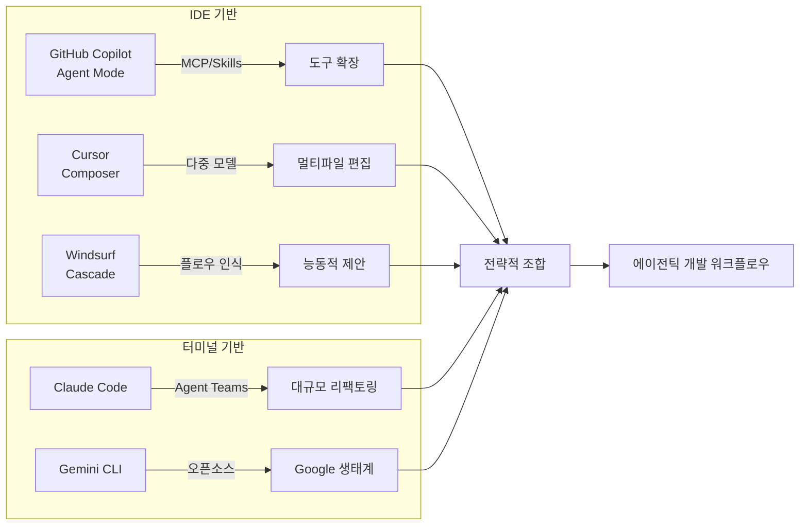
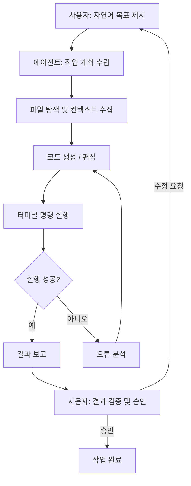
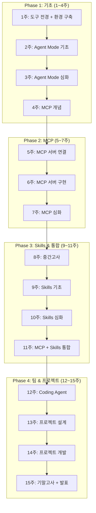

# 1주차. AI 코딩 도구 전경과 개발 환경 구축

> **1회차** (강의 90분): AI 코딩 도구 전경, 에이전틱 코딩의 개념, 바이브 코딩의 가능성과 한계
> **2회차** (실습 90분): VS Code + Copilot 설치·설정, GitHub Student Pack 등록, 첫 Copilot 대화

---

## 학습목표

1. 주요 AI 코딩 도구(GitHub Copilot, Claude Code, Cursor, Windsurf, Gemini CLI)의 특성과 전략적 위치를 비교·설명할 수 있다
2. 에이전틱 코딩(Agentic Coding)의 개념을 정의하고, 기존 자동완성 방식과의 차이를 구별할 수 있다
3. 바이브 코딩(Vibe Coding)의 가능성과 한계를 실무 사례를 통해 판단할 수 있다
4. VS Code + GitHub Copilot 실습 환경을 완성하고, 첫 AI 대화를 수행할 수 있다

## 선수지식

- Python 또는 JavaScript 중 1개 이상 사용 경험 (복잡한 프레임워크 지식 불필요)
- 기초 문법 수준: 변수 선언, 조건문, 함수 작성
- VS Code 파일 편집 경험 권장 (다른 편집기 사용자도 수강 가능)
- Git 기본 개념(커밋, 푸시, 풀) 이해 시 2회차 실습에 도움

---

## 1회차: 강의

### 1.1 AI 코딩 도구의 현재

- 2024년 말~2026년 초: AI 코딩 도구 시장, 단순 코드 자동완성을 넘어 "자율적 소프트웨어 개발" 국면에 진입
- 2021년 GitHub Copilot 등장 당시: "더 똑똑한 자동완성"으로 인식
  - 핵심 기능: 커서 위치에서 다음 줄을 제안하는 인라인 완성(Inline Completion)
- 5년이 지난 현재: 프로젝트 전체 탐색, 하위 작업 계획, 터미널 명령 실행, 오류 자동 수정 수준에 도달
- 각 도구는 서로 다른 철학과 아키텍처를 바탕으로 진화
  - 개발자는 강점과 약점을 파악하여 상황에 맞게 선택·조합하는 판단력이 필요

#### GitHub Copilot Agent Mode

- IDE 기반 AI 코딩 도구의 대표 주자
- VS Code 확장(Extension)으로 동작
- 2025년 중반 에이전트 모드(Agent Mode) 정식 출시 → 자율적 다단계 개발 가능
- 에이전트 모드 동작: 사용자 자연어 지시 → 파일 탐색, 코드 생성, 터미널 명령 실행, 오류 수정을 자율 수행
- 자율 실행 루프(Agentic Loop): 사용자가 목표만 제시하면 나머지를 Copilot이 판단·처리
  - 기존 Ask(질문)/Edit(편집) 모드와 근본적으로 다름
- **강점: 생태계 통합**
  - GitHub(세계 최대 코드 호스팅 플랫폼) 위에 구축
  - 리포지토리 컨텍스트, 이슈, PR, GitHub Actions와 자연스럽게 연결
  - 2025년 하반기 Coding Agent 도입: 이슈 할당 → 자동 브랜치 생성 → 코드 작성 → PR 생성
  - MCP(Model Context Protocol) 지원으로 외부 도구 연결 표준화
  - Skills 파일을 통한 도메인 지식 주입 가능
- **약점**
  - 터미널 기반 작업의 한계: VS Code 내부 동작이므로 대규모 리팩토링/복잡한 셸 스크립팅에서 IDE 제약
  - 생성 코드 품질이 프롬프트 구체성에 크게 의존
  - 보안 관련 코드(인증, 입력 검증 등)가 불완전하게 생성되는 경향

#### Claude Code

- Anthropic이 개발한 터미널 기반 AI 코딩 도구
- IDE에 종속되지 않고 커맨드라인에서 직접 실행
- 핵심 철학: "터미널이 곧 개발 환경"
- **강점: 대규모 코드베이스 멀티스텝 리팩토링**
  - 수십 개 파일에 걸친 구조적 변경을 계획 → 순차 수정 → 일관성 유지
  - Agent Teams: 여러 Claude Code 인스턴스 병렬 작업 → 대규모 프로젝트 생산성 향상
  - GitHub, GitLab 통합 지원 → 이슈 기반 자동 PR 생성 가능
- **약점**
  - 터미널 기반이므로 GUI 선호 개발자에게 진입 장벽 존재
  - 파일 편집의 시각적 피드백이 IDE 대비 제한적 → 별도 diff 도구/에디터 병용 필요

#### Cursor Composer

- VS Code를 포크(Fork)하여 AI 기능을 핵심에 내장한 전용 IDE
  - 확장으로 AI를 추가하는 방식이 아니라 편집기 자체가 AI 중심 설계
- Composer 모드: 프로젝트 전체 컨텍스트를 활용한 멀티파일 편집 지원
- **강점: 컨텍스트 관리의 정교함**
  - 코드베이스 인덱싱으로 프로젝트 전체 구조 파악, 관련 파일 자동 참조
  - 여러 AI 모델(Claude, GPT, Gemini 등) 자유 선택 → 작업 성격에 맞는 최적 모델 사용
  - Tab 기반 빠른 자동완성 + Composer 심층 분석 공존 → 단순·복합 작업 모두 효과적
- **약점**
  - VS Code 포크이므로 업데이트 시간 차이 발생 가능
  - VS Code 일부 확장 호환 불가
  - 유료 구독 모델(Pro, Business) 기본 → 비용 요인 고려 필요

#### Windsurf Cascade

- 구 Codeium, "플로우(Flow)" 개념 중심 설계
- Cascade(에이전틱 기능): 개발자의 작업 흐름을 실시간 추적 → 다음 필요 작업을 능동적 제안
  - 코드 작성 도중 관련 파일 변경 감지 → 다른 파일 수정 제안
- **차별점: 능동적 맥락 인식(Proactive Context Awareness)**
  - 개발자가 명시적 지시 없이도 작업 의도를 파악하여 관련 코드 변경을 미리 준비
  - 철학: "묻기 전에 답한다"

#### Gemini CLI

- Google 제공 터미널 기반 AI 코딩 도구, 오픈소스 공개
- Claude Code와 유사하게 커맨드라인 동작, Gemini 모델 기반
- 무료 티어에서도 상당한 사용량 제공 → 학습 목적 접근성 높음
- MCP 서버 연결 지원으로 외부 도구 통합 가능
- Google Cloud 생태계 연동에 강점

#### 전략적 비교와 조합

- 크게 세 가지 범주로 분류

**표 1.1** AI 코딩 도구의 범주별 분류

| 범주 | 도구 | 핵심 특성 | 최적 사용처 |
|------|------|----------|------------|
| IDE 내장형 | GitHub Copilot (VS Code) | 생태계 통합, MCP/Skills 지원, Coding Agent | GitHub 기반 팀 개발, 단계적 에이전트 도입 |
| AI 네이티브 IDE | Cursor, Windsurf | AI 중심 설계, 다중 모델 지원, 정교한 컨텍스트 | 개인 생산성 극대화, 멀티파일 편집 중심 작업 |
| 터미널 기반 | Claude Code, Gemini CLI | IDE 독립, 대규모 리팩토링, 셸 통합 | 대규모 코드베이스, CI/CD 파이프라인, 자동화 |

- 실무에서 가장 효과적인 접근: 단일 도구 의존이 아닌 상황별 전략적 조합
  - 예: 초기 구조 → Copilot Agent Mode / 멀티파일 리팩토링 → Claude Code / 빠른 편집·탐색 → Cursor Tab 완성
- 이 과목에서는 GitHub Copilot을 주 도구로 사용하되, 각 도구의 강점을 이해하여 적재적소에 활용하는 판단력을 함께 기름


**그림 1.1** AI 코딩 도구의 범주와 전략적 조합

---

### 1.2 에이전틱 코딩이란 무엇인가

- **정의**: AI가 단순 코드 제안을 넘어 목표를 해석하고 다단계 작업을 자율적으로 계획·실행·검증하는 소프트웨어 개발 방식
- 2024년 후반부터 본격 사용된 용어
- AI 코딩 도구가 "수동적 보조자" → "능동적 협업자"로 진화한 전환점을 표현

#### 자동완성에서 에이전트로의 진화

**표 1.2** AI 코딩 도구의 발전 단계

| 단계 | 시기 | 대표 기능 | AI의 역할 | 사람의 역할 |
|------|------|----------|----------|------------|
| 1세대 | 2021-2022 | 인라인 자동완성 | 다음 줄 제안 | 제안 수락/거부 |
| 2세대 | 2023-2024 | 채팅 기반 코드 생성 | 질문에 답변, 코드 블록 생성 | 코드 복사, 수동 적용 |
| 3세대 | 2025-현재 | 에이전틱 모드 | 다단계 자율 실행, 오류 자동 수정 | 목표 설정, 결과 검증, 승인 |

- **1세대**: 커서 위치의 맥락을 읽고 다음 코드 줄 제안 → Tab 키로 수락/무시가 상호작용의 전부
- **2세대**: 채팅 인터페이스 도입 → "이 함수를 리팩토링해 줘" 같은 자연어 요청 가능, 단 생성 코드를 개발자가 직접 복사·붙여넣기 필요
- **3세대(에이전틱 코딩)**: 근본적 전환 발생
  - AI가 프로젝트 전체를 작업 대상으로 삼음
  - 파일 시스템 탐색 → 여러 파일에 걸쳐 코드 수정 → 터미널에서 명령 실행 → 오류 감지 및 자동 수정
  - 이 전체 과정이 하나의 자율 실행 루프(Agentic Loop)로 동작


**그림 1.2** 에이전틱 코딩의 자율 실행 루프

#### 에이전틱 코딩의 핵심 특성

- 기존 AI 코딩 보조와 구분 짓는 네 가지 핵심 특성:

1. **자율적 계획 수립(Autonomous Planning)**: 사용자의 목표를 하위 작업으로 분해하고 실행 순서를 자율 결정
   - 예: "Flask 웹앱을 만들어 줘" → 프로젝트 구조 설계, 라우트 작성, 템플릿 생성, 의존성 설치, 서버 실행으로 분해
2. **도구 사용(Tool Use)**: 파일 읽기/쓰기, 터미널 명령 실행, 웹 검색, 외부 API 호출 등 다양한 도구를 상황에 맞게 선택·사용
   - MCP(Model Context Protocol): 도구 사용을 표준화하는 프로토콜 (4주차에서 본격 학습)
3. **자기 수정(Self-Correction)**: 코드 실행 오류 발생 시 오류 메시지 분석 → 원인 추론 → 코드 수정 → 재실행
   - 여러 차례 반복 가능, 사람 개입 없이 상당수 일반적 오류 해결
4. **멀티파일 맥락 유지(Multi-file Context)**: 프로젝트 전체를 작업 맥락으로 유지
   - 한 파일의 인터페이스 변경 시 이를 참조하는 다른 파일도 함께 수정
   - 대규모 리팩토링에서 특히 중요

#### 에이전틱 코딩에서 사람의 역할

- 에이전틱 코딩 도입 ≠ 개발자 역할 소멸
- 역할의 성격 변화: "코드를 직접 작성하는 사람" → "목표를 설정하고 결과를 검증하는 사람"

**표 1.3** 에이전틱 코딩에서의 역할 분담

| 영역 | AI 에이전트가 수행 | 사람이 수행 |
|------|-------------------|------------|
| 목표 설정 | - | 요구사항 정의, 제약 조건 명시 |
| 설계 판단 | 구현 수준 설계 제안 | 아키텍처 결정, 트레이드오프 판단 |
| 코드 작성 | 코드 생성, 반복 패턴 구현 | 핵심 로직 검증, 엣지 케이스 확인 |
| 테스트 | 단위 테스트 생성, 실행 | 테스트 전략 설계, 경계값 검증 |
| 디버깅 | 오류 분석 및 자동 수정 | 논리적 오류 판단, 근본 원인 분석 |
| 보안 | 기본 패턴 적용 | 보안 요구사항 정의, 취약점 감사 |
| 배포 | 설정 파일 생성 | 배포 전략 결정, 운영 모니터링 |

- 핵심: AI가 "어떻게(How)" 담당, 사람이 "무엇을(What)"과 "왜(Why)" 담당
- 에이전틱 코딩 시대의 핵심 개발자 역량:
  - 좋은 프롬프트 작성 능력
  - 생성 코드 품질 판단 능력
  - AI가 놓친 엣지 케이스 식별 능력

---

### 1.3 바이브 코딩의 가능성과 한계

#### 바이브 코딩이란 무엇인가

- **정의**: 개발자가 자연어로 원하는 바를 설명 → AI가 코드 생성 → 결과의 "분위기(vibe)"만 확인하여 수락/수정 요청하는 개발 방식
- 용어 창시: 2025년 2월, Andrej Karpathy
- Karpathy의 표현: "코드를 보지 않고, AI가 만든 것을 그냥 받아들이며, 동작하면 넘어가는" 방식
- 핵심 전제: 코드 내부 구조 이해 없이도 동작하는 소프트웨어 제작 가능
  - 프로그래밍 민주화 관점에서 혁명적 가능성
  - 동시에 소프트웨어 공학 근본 원칙과 충돌하는 문제 내포

#### 바이브 코딩이 효과적인 영역

- **프로토타이핑과 개념 검증(PoC)**: 가장 강력한 효과
  - "이 아이디어가 기술적으로 가능한가?"에 대한 답을 며칠이 아닌 몇 시간 만에 도출
  - 스타트업 MVP, 해커톤, 사내 데모에서 시간 대비 산출물 양 압도적 우위
- **일회성 스크립트와 자동화**
  - CSV 정리, 이미지 일괄 변환, 특정 패턴 로그 추출 등 단발성 작업
  - 장기 유지보수 불필요 → 세밀한 코드 검토 없이도 실용적 가치 충분
- **학습과 탐색**
  - 새로운 기술/라이브러리 빠른 체험 수단
  - 예: "FastAPI로 간단한 REST API를 만들어 줘" → 프레임워크 기본 구조와 관례를 코드로 확인
  - 공식 문서 전에 동작 예제를 먼저 보는 것이 효과적인 경우 다수

#### 바이브 코딩이 실패하는 영역

1. **보안이 중요한 시스템**: 위험
   - AI 생성 인증 코드의 SQL 인젝션 취약, API 키 클라이언트 사이드 노출, CSRF 토큰 누락 등 빈번
   - "동작한다" ≠ "안전하다"
   - 보안 취약점은 기능적 테스트로 드러나지 않음 → 코드를 읽지 않는 방식에서는 발견 자체가 불가
2. **유지보수가 필요한 코드**: 기술 부채(Technical Debt) 급속 누적
   - 이해하지 못한 채 수락한 코드 → 버그 발생 시 디버깅 불가
   - 변수명, 함수 구조, 모듈 분리 등 품질 세부사항 미검토 → 프로젝트 성장 시 수정 비용 기하급수적 증가
3. **복잡한 비즈니스 로직**: 논리적 오류 발생
   - AI는 일반적 패턴은 잘 생성하나, 도메인 고유 규칙 정확 구현에 한계
   - 예: "연속 3일 이상 초과근무 시 다음 날 자동 휴무 배정" 같은 미묘한 조건 분기
   - AI가 잘못 해석해도 기능적으로는 동작하는 것처럼 보일 수 있음

#### 에이전틱 코딩과 바이브 코딩의 차이

- 공통점: AI를 활용한 개발
- 근본적 차이 존재:

**표 1.4** 에이전틱 코딩과 바이브 코딩의 비교

| 항목 | 에이전틱 코딩 | 바이브 코딩 |
|------|-------------|------------|
| 코드 이해 | 필수 (개발자가 생성 코드를 검증) | 선택 (결과만 확인) |
| 검증 수준 | 기능 + 보안 + 코드 품질 | 기능 동작 여부만 확인 |
| 적용 범위 | 프로덕션 코드 포함 | 프로토타입, 일회성 작업 중심 |
| 개발자 역량 | 설계·검증·판단 능력 필요 | 자연어 설명 능력 중심 |
| 기술 부채 | 통제 가능 | 급속 누적 위험 |
| 이 과목의 지향 | 에이전틱 코딩 | - |

- **이 과목의 지향: 에이전틱 코딩**
  - AI를 적극 활용하되, 생성 코드를 이해·검증하고, 설계 판단은 사람이 주도
  - 바이브 코딩의 빠른 생산성은 프로토타이핑 단계에서 활용
  - 프로덕션 코드에서는 반드시 사람의 검증을 거치는 균형 잡힌 접근 추구

---

### 1.4 이 과목에서 배울 것

- 15주에 걸쳐 GitHub Copilot 중심으로 AI 에이전트 개발의 전체 흐름 학습
- AI 도구 사용법뿐 아니라 도구 확장 표준(MCP), 도메인 지식 주입(Skills), 팀 워크플로우 통합(Coding Agent)까지 단계적 발전

#### 전체 로드맵

- 네 가지 Phase로 구성:

1. **Phase 1: 기초 (1~4주)**: AI 코딩 도구 전경 파악, Copilot 에이전트 모드 심층 체험, MCP 개념·아키텍처 이해
   - 목표: "AI와 함께 코딩하는 것"에 익숙해지기
2. **Phase 2: MCP (5~7주)**: 기존 MCP 서버 연결로 Copilot 능력 확장, Python SDK로 자체 MCP 서버 구현, 프로덕션 수준 에러 처리·테스트 적용
   - 목표: "AI가 사용할 수 있는 도구를 직접 만드는 것"
3. **Phase 3: Skills & 통합 (9~11주)**: SKILL.md로 도메인 지식·절차 주입, MCP + Skills 조합으로 실무 자동화 에이전트 완성
   - 목표: "AI에게 무엇을 어떻게 해야 하는지 가르치는 것"
4. **Phase 4: 팀 & 프로젝트 (12~15주)**: Coding Agent 활용 팀 워크플로우 자동화, 최종 프로젝트로 전체 과정 통합


**그림 1.3** 15주 과목 로드맵

#### 핵심 역량의 축적 구조

- 각 Phase에서 쌓이는 역량이 다음 단계의 기반:
  - Agent Mode 이해 → MCP 필요성 인식
  - MCP 서버 구현 → Skills와 통합 가능
  - 전체를 갖추어야 팀 수준 에이전트 워크플로우 설계 가능
- 주차별 과제: 단순 기능 구현이 아닌 이전 주차 개념을 현재 작업에 적용하는 누적 구조

**표 1.5** Phase별 핵심 질문과 산출물

| Phase | 핵심 질문 | 주요 산출물 |
|-------|----------|------------|
| 1: 기초 | AI 코딩 도구는 어디까지 할 수 있는가? | Agent Mode로 생성한 웹앱, MCP 아키텍처 다이어그램 |
| 2: MCP | AI에게 새로운 도구를 어떻게 제공하는가? | MCP 서버 3종 연결, 커스텀 MCP 서버 구현 |
| 3: Skills | AI에게 도메인 지식을 어떻게 가르치는가? | SKILL.md, MCP+Skills 통합 에이전트 |
| 4: 팀 | AI를 팀 워크플로우에 어떻게 통합하는가? | Coding Agent 워크플로우, 최종 프로젝트 |

- 과목 종료 시 목표: "AI 코딩 도구를 사용할 수 있는 사람" → "AI 에이전트가 사용할 도구와 지식을 설계하고, 팀 워크플로우에 통합할 수 있는 사람"

---

## 2회차: 실습

### 실습 1: 개발 환경 구축

- 15주 전체에서 사용할 개발 환경 구축
- 환경이 올바르게 설정되지 않으면 이후 모든 실습에 영향 → 각 단계를 꼼꼼하게 확인

#### 단계 1: VS Code 설치 및 버전 확인

- VS Code 공식 사이트(https://code.visualstudio.com/)에서 운영체제에 맞는 최신 버전 다운로드·설치
- 이미 설치된 경우: "Help > Check for Updates"로 최신 버전 갱신
- 에이전트 모드 + Skills 완전 지원을 위해 **버전 1.102 이상** 필요
- 권장: VS Code Insiders 채널(https://code.visualstudio.com/insiders/) 사용
- 설치 후 터미널에서 버전 확인:

```bash
code --version
```

- 출력 버전 번호가 1.102 이상인지 확인

#### 단계 2: GitHub 계정 및 Student Developer Pack 등록

- GitHub 계정이 없는 경우: https://github.com 에서 계정 생성
- 학생인 경우: GitHub Student Developer Pack(https://education.github.com/pack) 등록 → Copilot Pro 무료 사용
- 등록 절차:
  1. GitHub Education 페이지 접속 → "Get your Pack" 클릭
  2. 학교 이메일(.ac.kr 또는 .edu) 입력·인증
  3. 학생 신분 증명 서류(학생증 사진 등) 업로드
  4. 승인까지 통상 1~7일 소요
- 승인 완료 후: Settings > Copilot 페이지에서 활성화 확인
- 미승인 시: Copilot Free 플랜(월 2,000회 코드 완성, 50회 채팅) 우선 사용 → 승인 후 Pro 전환

#### 단계 3: Copilot 확장 설치

- VS Code 열기 → 좌측 사이드바 확장(Extensions) 아이콘 클릭 (또는 Ctrl+Shift+X / macOS: Cmd+Shift+X)
- 검색창에 "GitHub Copilot" 입력 → 다음 두 확장 설치:
  - **GitHub Copilot**: 인라인 코드 완성 기능 제공
  - **GitHub Copilot Chat**: 채팅 인터페이스, Ask/Edit/Agent 모드 제공
- 설치 후 확인사항:
  - VS Code 하단 상태바에 Copilot 아이콘 표시 여부
  - 아이콘에 경고 표시 시 → 좌측 하단 계정 아이콘 클릭 → GitHub 계정 로그인

#### 단계 4: Python 및 Node.js 환경 확인

- Python: MCP 서버 구현용 / Node.js: 일부 MCP 서버 실행(npx)용
- 터미널에서 설치 상태 확인:

```bash
python3 --version    # 3.10 이상 필요
node --version       # 18 이상 필요
npm --version        # Node.js와 함께 설치됨
git --version        # Git 설치 확인
```

- 미설치 시: Python → https://www.python.org/ / Node.js → https://nodejs.org/
- macOS 사용자: Homebrew 활용 가능 (`brew install python node`)

#### 단계 5: 에이전트 모드 활성화 확인

- VS Code 설정(Ctrl+, 또는 Cmd+,) → "chat.agent.enabled" 검색 → 활성화 확인
- 활성화 시: Copilot Chat 패널(Ctrl+Shift+I 또는 Cmd+Shift+I)의 모드 선택 드롭다운에서 "Agent" 옵션 표시

#### 환경 구축 완료 체크리스트

| 항목 | 확인 명령 / 방법 | 기대 결과 |
|------|-----------------|----------|
| VS Code 버전 | `code --version` | 1.102 이상 |
| Copilot 확장 | 확장 목록 확인 | GitHub Copilot + Chat 설치됨 |
| GitHub 로그인 | 하단 상태바 Copilot 아이콘 | 경고 없이 활성화 |
| Python | `python3 --version` | 3.10 이상 |
| Node.js | `node --version` | 18 이상 |
| Git | `git --version` | 설치 확인 |
| Agent 모드 | Copilot Chat 모드 선택 | "Agent" 옵션 표시 |

---

### 실습 2: 첫 Copilot 대화

- 환경 구축 완료 후, 세 가지 상호작용 모드의 차이를 직접 체험

#### Ask 모드 체험

- 아무 Python 파일 생성 (예: `hello.py`), 간단한 코드 작성:

```python
def fibonacci(n):
    if n <= 1:
        return n
    return fibonacci(n - 1) + fibonacci(n - 2)

result = fibonacci(10)
print(f"fibonacci(10) = {result}")
```

- Copilot Chat 열기(Ctrl+Shift+I 또는 Cmd+Shift+I) → 모드: "Ask" 선택 → 질문:

```
이 fibonacci 함수의 시간 복잡도는 얼마인가요?
```

- 예상 응답: 재귀 호출 구조 분석 → 시간 복잡도 O(2^n) 설명, 개선 방법(메모이제이션, 반복문 등) 제안
- 확인 포인트: Ask 모드에서는 파일이 변경되지 않음 → 읽기 전용 상호작용

#### Edit 모드 체험

- 같은 파일을 열어 둔 상태 → 모드: "Edit" 전환 → 요청:

```
이 fibonacci 함수를 메모이제이션을 사용하도록 개선해 줘
```

- 예상 동작: 파일 내용 직접 수정 → `functools.lru_cache` 데코레이터 추가 또는 딕셔너리 기반 메모이제이션 작성
- 변경 사항이 diff 형태로 표시 → 수락/거부 선택 가능
- 확인 포인트: Edit 모드에서는 사용자가 지정한 파일 범위 내에서만 변경

#### Agent 모드 체험

- 모드: "Agent" 전환 → 복합적 요청:

```
피보나치 수열의 처음 20개 항을 계산하고, 결과를 CSV 파일로 저장하는 스크립트를 만들어 줘. 실행까지 해 줘.
```

- Agent 모드에서 Copilot이 자율적으로 수행하는 단계:
  1. 새 Python 파일 생성
  2. 피보나치 계산 함수 + CSV 저장 로직 작성
  3. 터미널에서 스크립트 실행 시도 → "Allow" 버튼으로 사용자 승인 요청
  4. 승인 시 스크립트 실행 → CSV 파일 생성 → 결과 보고
  5. 실행 도중 오류 발생 시 자동 코드 수정 후 재실행 시도
- 세 가지 모드 체험 후 노트에 기록:
  1. Ask/Edit/Agent 각 모드에서 Copilot이 수행한 작업 범위의 차이
  2. Agent 모드에서 사용자 승인(Allow)이 요청된 시점
  3. 생성 코드에서 개선이 필요한 부분 (있다면 구체적으로)
- 이 기록은 과제 제출의 일부

---

## 과제

**제출 항목**: 다음 두 가지를 GitHub 리포지토리에 제출한다.

1. **환경 구축 스크린샷** (3장)
   - VS Code에서 Copilot 확장이 설치되고 활성화된 화면
   - 터미널에서 Python, Node.js, Git 버전을 확인한 화면
   - Copilot Chat에서 Agent 모드가 선택 가능한 화면

2. **첫 Copilot 대화 결과**
   - 실습 2에서 수행한 세 가지 모드(Ask/Edit/Agent) 대화의 스크린샷 또는 텍스트 기록
   - 각 모드에서 관찰한 차이점을 정리한 간단한 메모 (5줄 이상)

**제출 기한**: 2회차 수업 종료 후 1주일 이내

**평가 기준**: 환경 구축 완료 여부(50%), Copilot 대화 수행 여부(30%), 관찰 기록의 구체성(20%)

---

## 핵심 정리

- AI 코딩 도구는 IDE 내장형(GitHub Copilot), AI 네이티브 IDE(Cursor, Windsurf), 터미널 기반(Claude Code, Gemini CLI)의 세 범주로 나뉘며, 각각 고유한 강점을 가진다
- 에이전틱 코딩은 AI가 자율적으로 계획·실행·수정하는 개발 방식이며, 자동완성과 근본적으로 다르다
- 에이전틱 코딩에서 사람의 역할은 "코드 작성"에서 "목표 설정과 결과 검증"으로 전환된다
- 바이브 코딩은 프로토타이핑에 효과적이나, 보안·유지보수·복잡한 로직에서는 심각한 한계가 있다
- 이 과목은 Agent Mode에서 출발하여 MCP, Skills, Coding Agent까지 단계적으로 역량을 쌓아 간다

---

## 참고 자료

### 공식 문서
- GitHub Copilot Documentation. https://docs.github.com/en/copilot
- VS Code Copilot Agent Mode. https://code.visualstudio.com/docs/copilot/chat/chat-agent-mode
- GitHub Student Developer Pack. https://education.github.com/pack

### 도구별 공식 사이트
- Claude Code. https://docs.anthropic.com/en/docs/claude-code
- Cursor. https://www.cursor.com
- Windsurf. https://windsurf.com
- Gemini CLI. https://github.com/google-gemini/gemini-cli

### 핵심 참고 자료
- Karpathy, A. (2025). "Vibe Coding." https://x.com/karpathy/status/1886192184808149383
- GitHub Blog. (2025). "GitHub Copilot: The agent awakens." https://github.blog/news-insights/product-news/github-copilot-the-agent-awakens/

---

## 다음 주 예고

- 2주차: GitHub Copilot 에이전트 모드(Agent Mode) 본격 학습
  - 세 가지 모드(Ask/Edit/Agent) 동작 원리 정밀 비교
  - 에이전트 모드의 자율 실행 루프 내부 동작 분석
- 2회차 실습: 자연어 한 문장으로 Flask Todo 웹앱 전체 생성
  - 에이전트가 생성한 코드에서 사람이 검증해야 하는 지점 식별 실전 경험
