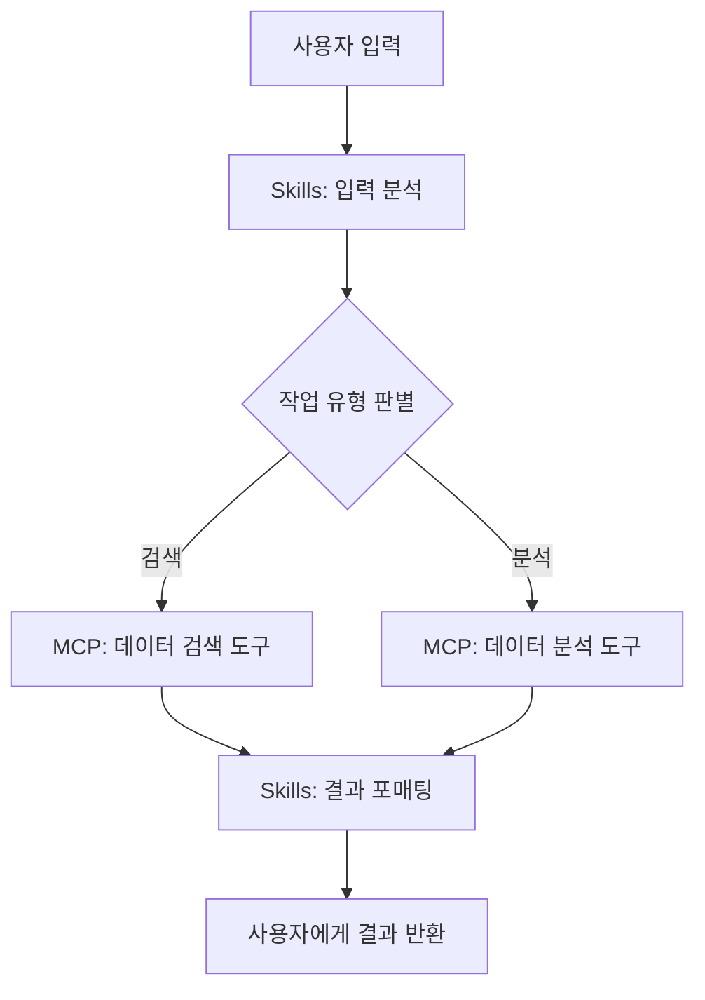

# 13주차. 최종 프로젝트 설계

> **1회차** (강의 90분): 프로젝트 가이드라인, 평가 기준, 주제 예시, 설계 방법론, 발표 형식 안내
> **2회차** (실습 90분): 프로젝트 주제 확정, 설계서 작성, 프로토타입 시작

---

## 학습목표

1. 최종 프로젝트의 평가 기준과 요구사항을 정확히 이해한다
2. 요구분석에서 아키텍처, 구현계획에 이르는 체계적인 설계 방법론을 적용한다
3. MCP 서버와 Skills를 조합한 에이전트의 설계서를 작성하고 프로토타입을 시작한다

## 선수지식

- 11주차까지 다룬 MCP 서버 구현(6-7주차), Skills 설계(9-10주차), MCP + Skills 통합(11주차)의 전체 내용을 숙지해야 함
- 12주차에서 다룬 Coding Agent와 팀 워크플로우의 개념도 프로젝트 설계에 반영할 수 있으므로 복습을 권장

---

## 1회차: 강의 — 프로젝트 가이드라인과 설계 방법론

### 13.1 프로젝트 개요와 목적

- 최종 프로젝트는 1주차부터 12주차까지 학습한 모든 기술 요소를 종합하여 하나의 완성된 AI 에이전트를 설계하고 구현하는 과정
- 핵심 목적: 단순히 코드를 작성하는 것이 아니라, 문제를 정의하고, 아키텍처를 설계하고, 구현하고, 시연하는 소프트웨어 공학의 전체 주기를 경험하는 것
- 수행 형태
  - 개인 또는 2인 팀으로 수행 가능
  - 팀 프로젝트의 경우 역할 분담을 설계서에 명시해야 하며, 각 구성원의 기여도를 Git 커밋 이력으로 확인할 수 있어야 함
  - 개인 프로젝트는 범위를 적절히 조절하되, MCP 서버와 Skills를 모두 포함해야 한다는 최소 요건은 동일

### 13.2 평가 기준

- 최종 프로젝트의 평가는 다섯 가지 항목으로 구성됨

**표 13.1** 최종 프로젝트 평가 기준

| 항목 | 비중 | 세부 평가 요소 |
|------|:----:|--------------|
| MCP 서버 구현 완성도 | 30% | 도구(Tool)/리소스(Resource) 설계의 적절성, 에러 처리와 입력 검증, Inspector 테스트 통과 여부 |
| Skills 설계 적절성 | 20% | 절차 정의의 명확성, 트리거 조건의 구체성, 재사용 가능성, 3단계 점진적 공개 적용 |
| 통합 워크플로우 | 20% | MCP(도구)와 Skills(절차)의 역할 분담, 설계 패턴 적용(단일도구/파이프라인/감독자), 종단간 동작 검증 |
| 발표 및 의사소통 | 15% | 논리적 구성, 데모 시연의 완성도, 질의응답 대응력, 시간 관리 |
| 코드 품질 | 15% | 코드 구조와 가독성, 주석과 문서화, Git 커밋 이력의 체계성, PEP 8 준수 |

- **MCP 서버 구현 완성도(30%)**가 가장 높은 비중을 차지하는 이유
  - 이 과목의 핵심 기술 역량이 MCP 서버의 설계와 구현에 있기 때문
  - 단순히 기존 서버를 연결하는 것이 아니라, 자신의 도메인에 맞는 도구와 리소스를 직접 설계하고 구현해야 함
- **Skills 설계(20%)**: 절차의 구체성, 에이전트 해석 시 모호함의 부재, 재사용 가능성을 평가
- **통합 워크플로우(20%)**: MCP와 Skills가 유기적으로 연결되어 하나의 자동화 흐름을 구성하는지 확인, 11주차의 세 가지 설계 패턴 중 적합한 패턴을 선택한 근거를 설명할 수 있어야 함
- **발표(15%)**: 데모 시연의 완성도와 질의응답 대응력을 평가
- **코드 품질(15%)**: 가독성, 문서화, Git 이력의 체계성을 평가

### 13.3 프로젝트 주제 예시

**표 13.2** 프로젝트 주제 예시

| 주제 | MCP 서버 | Skills | 난이도 |
|------|----------|--------|:------:|
| 학과 공지 요약 에이전트 | 웹 크롤링 도구 (공지 목록/상세 파싱) | 요약 절차 (분류 → 추출 → 요약문 생성) | 중 |
| 코드 리뷰 자동화 봇 | GitHub API 도구 (PR/diff 조회, 코멘트 작성) | 리뷰 체크리스트 (구조 → 보안 → 성능 → 가독성) | 중상 |
| 논문 검색·분석 에이전트 | arXiv 검색 도구 (키워드 검색, 초록/메타데이터) | 분석 절차 (검색 → 필터링 → 초록 분석 → 동향 요약) | 중 |
| 일정 관리 에이전트 | 캘린더 관리 도구 (CRUD, 충돌 검사) | 스케줄링 절차 (파싱 → 충돌 검사 → 등록 → 알림) | 중 |
| 데이터 파이프라인 자동화 | DB 조회 도구 (SQL 실행, 스키마, 포매팅) | ETL 절차 (추출 → 정제 → 변환 → 보고서) | 중상 |

- 각 주제의 핵심: MCP 서버를 통해 외부 데이터에 접근하고, Skills를 통해 그 데이터를 처리하는 절차를 정의하는 구조
- 위 목록은 참고용이며, 자유 주제를 선택하는 경우 반드시 교수자의 사전 승인을 받아야 함

### 13.4 설계 방법론: 요구분석에서 구현계획까지

- 프로젝트 설계는 세 단계로 진행
- 각 단계의 산출물이 다음 단계의 입력이 되는 순차적 구조

#### 1단계: 요구분석 (Requirements Analysis)

- "무엇을 만들 것인가"를 정의
- 다음 질문에 명확히 답할 수 있어야 함
  - **문제 정의**: 어떤 문제를 해결하는가? 현재 이 문제를 어떻게 처리하고 있는가?
  - **대상 사용자**: 누가 이 에이전트를 사용하는가? 사용자의 기술 수준은 어느 정도인가?
  - **핵심 기능**: 에이전트가 반드시 수행해야 하는 기능은 무엇인가? (최소 3개)
  - **입출력 정의**: 사용자가 제공하는 입력은 무엇이고, 에이전트가 반환하는 출력은 무엇인가?
  - **성공 기준**: 에이전트가 "잘 동작한다"를 어떻게 판단하는가?
- 요구분석의 결과는 한 페이지 분량의 요구사항 명세서(Requirements Specification)로 작성
- 이 문서는 프로젝트 전체의 방향을 결정하므로, 구현을 시작하기 전에 반드시 확정해야 함

#### 2단계: 아키텍처 설계 (Architecture Design)

- "어떻게 만들 것인가"를 정의
- 핵심: MCP 서버와 Skills의 역할 분담을 결정하는 것
- 아키텍처 설계서에 포함해야 할 내용
  - 시스템 구성도(Copilot-MCP-Skills 관계 다이어그램)
  - MCP 서버 설계(도구 목록과 입출력 스키마)
  - Skills 설계(SKILL.md 구조, 트리거 조건, 실행 절차)
  - 데이터 흐름도
  - 설계 패턴 선택 근거
- 11주차에서 다룬 세 가지 설계 패턴 복습

**표 13.3** 통합 설계 패턴 비교

| 패턴 | 구조 | 적합한 상황 |
|------|------|-----------|
| 단일도구 | Skills가 하나의 MCP 도구를 호출 | 단순한 조회/변환 작업 |
| 파이프라인 | Skills가 여러 MCP 도구를 순차적으로 호출 | ETL, 데이터 처리 워크플로우 |
| 감독자 | Skills가 조건에 따라 다른 MCP 도구를 선택 | 분기가 많은 복합 워크플로우 |

#### 3단계: 구현계획 (Implementation Plan)

- "언제, 무엇을 완성할 것인가"를 정의
- 13주차와 14주차의 남은 시간을 고려하여 현실적인 일정을 수립해야 함
- 구현계획에 포함할 내용
  - 마일스톤(주요 완성 시점)
  - 작업 분해(세부 작업 목록)
  - 우선순위(Must Have vs Nice to Have)
  - 위험 요소와 대응 방안
  - 역할 분담(팀 프로젝트의 경우)
- 가장 흔한 실수: 범위를 과도하게 설정하는 것
  - 3개의 핵심 기능을 완벽하게 구현하는 것이 10개의 기능을 불완전하게 구현하는 것보다 높은 평가를 받음

### 13.5 발표 형식

- 최종 발표는 15주차 2회차에 진행
- 팀/개인당 10분 발표 + 5분 질의응답으로 구성

**표 13.4** 최종 발표 구성

| 순서 | 시간 | 내용 | 비고 |
|:----:|:----:|------|------|
| 1 | 2분 | 문제 정의와 동기 | 왜 이 에이전트가 필요한가 |
| 2 | 3분 | 시스템 아키텍처 | MCP 서버 + Skills 구성도, 설계 패턴 |
| 3 | 3분 | 데모 시연 | 실제 동작하는 에이전트를 시연 |
| 4 | 2분 | 한계점 및 향후 과제 | 현재 한계와 개선 방향 |
| 5 | 5분 | 질의응답 | 교수자 및 동료 학생의 질문 |

- 발표 자료는 슬라이드 10장 이내로 제한
- 데모 시연이 핵심이므로 충분한 리허설을 수행
- 돌발 상황(네트워크 오류, API 키 만료)에 대비하여 녹화 영상을 백업으로 준비하는 것을 권장
- 질의응답에서 대비해야 할 질문 예시
  - "왜 이 설계 패턴을 선택했는가"
  - "이 에이전트의 가장 큰 한계는 무엇인가"
  - 이러한 질문에 논리적으로 답변할 수 있어야 함

### 13.6 프로젝트 산출물 목록

- 최종 제출 시 GitHub 저장소에 포함해야 할 산출물
  - 프로젝트 설계서(Markdown/PDF)
  - MCP 서버 코드(Python)
  - Skills 파일(SKILL.md)
  - mcp.json 설정
  - README.md(실행 방법, 의존성)
  - 발표 자료(PDF, 10장 이내)
- 데모 영상(MP4)은 선택 사항이나 실시간 시연 백업용으로 권장
- 14주차 2회차 종료 시점까지 최종 커밋을 완료해야 함

---

## 2회차: 실습 — 주제 확정과 설계서 작성

### 실습 1: 프로젝트 주제 선정

- 다음 절차에 따라 프로젝트 주제를 확정

1. 관심 있는 주제를 3개 후보로 선정
2. 각 후보에 대해 다음 항목을 간략히 작성
   - 해결하려는 문제 (1-2문장)
   - 필요한 MCP 도구 목록 (최소 2개)
   - 필요한 Skills (최소 1개)
   - 예상 난이도와 구현 가능성
3. 3개 후보 중 가장 적합한 주제를 선택하고 교수자의 확인을 받기

- 주제 선택 시 고려 기준
  1. 2주 내에 구현이 가능한 범위인가
  2. MCP 서버와 Skills를 모두 유의미하게 활용하는 주제인가
  3. 실제 동작을 시연할 수 있는가
  4. 본인의 관심사와 연결되어 동기 부여가 되는가

### 실습 2: 설계서 작성

- 주제가 확정되면 다음 구조에 따라 설계서를 작성

#### 설계서 템플릿

```markdown
# 프로젝트 설계서: {프로젝트명}

## 1. 요구분석
### 1.1 문제 정의
### 1.2 대상 사용자
### 1.3 핵심 기능 (최소 3개)
### 1.4 입출력 정의
### 1.5 성공 기준

## 2. 아키텍처 설계
### 2.1 시스템 구성도 (다이어그램)
### 2.2 MCP 서버 설계
- 도구(Tool) 목록과 입출력 스키마
- 리소스(Resource) 정의 (해당 시)
### 2.3 Skills 설계
- SKILL.md 구조
- 트리거 조건과 실행 절차
### 2.4 데이터 흐름
### 2.5 설계 패턴 선택과 근거

## 3. MCP 서버 설정
### 3.1 mcp.json 구성

## 4. 구현계획
### 4.1 마일스톤
### 4.2 작업 분해
### 4.3 위험 요소와 대응 방안
### 4.4 역할 분담 (팀 프로젝트의 경우)
```

#### MCP 서버 설정 예시

- 설계서의 `mcp.json` 구성 섹션에는 다음과 같은 형식으로 서버 설정을 명시

```json
{
  "mcpServers": {
    "my-agent-server": {
      "type": "stdio",
      "command": "python3",
      "args": ["src/mcp_server.py"],
      "env": {
        "API_KEY": "${input:apiKey}"
      }
    }
  }
}
```

#### 워크플로우 다이어그램 예시

- 설계서에는 에이전트의 전체 동작 흐름을 Mermaid 다이어그램으로 포함



### 실습 3: 프로토타입 시작

- 설계서 작성이 완료되면 프로토타입 구현을 시작
- 남은 시간 동안 수행할 작업

1. GitHub 저장소를 생성하고 기본 디렉터리 구조를 설정
2. MCP 서버의 골격 코드를 작성 (도구 등록까지)
3. SKILL.md 파일의 초안을 작성
4. mcp.json 설정 파일을 작성하고 서버 연결을 확인

- 프로토타입 단계에서는 모든 기능을 구현할 필요 없음
- 가장 핵심적인 도구 하나가 동작하는 것을 확인하는 것이 목표
- 이 "동작하는 최소 버전"을 기반으로 14주차에서 기능을 확장하고 완성도를 높임

---

## 과제

**제출물**: 프로젝트 설계서 (아키텍처 다이어그램 포함)

- 형식: Markdown 파일, GitHub 저장소에 커밋
- 분량: 요구분석 + 아키텍처 설계 + 구현계획을 모두 포함 (최소 2페이지)
- 기한: 14주차 1회차 수업 시작 전까지
- 필수 포함 항목: 시스템 구성도(다이어그램), MCP 도구 목록, Skills 구조, mcp.json 설정

---

## 핵심 정리

- 최종 프로젝트는 MCP 서버(30%), Skills 설계(20%), 통합 워크플로우(20%), 발표(15%), 코드 품질(15%)의 다섯 가지 항목으로 평가한다
- 설계는 요구분석 → 아키텍처 설계 → 구현계획의 세 단계로 진행하며, 각 단계의 산출물이 다음 단계의 입력이 된다
- 프로젝트 범위를 현실적으로 설정하는 것이 중요하다 — 3개의 핵심 기능을 완벽히 구현하는 것이 10개의 불완전한 기능보다 높은 평가를 받는다
- 발표는 10분 발표 + 5분 질의응답으로 구성되며, 실제 동작하는 데모 시연이 핵심이다

---

## 참고 자료

- 11주차 강의안: MCP + Skills 통합 설계 패턴 (단일도구, 파이프라인, 감독자)
- 12주차 강의안: Coding Agent와 팀 워크플로우
- MCP Python SDK 공식 문서: https://github.com/modelcontextprotocol/python-sdk
- VS Code Agent Skills 공식 문서: https://code.visualstudio.com/docs/copilot/chat/chat-agent-mode#_agent-skills

---

## 다음 주 예고

- 14주차에서는 프로젝트 중간 점검 발표를 진행
- 각 팀/개인이 현재까지의 진행 상황을 5분 이내로 발표하고, 교수자와 동료 학생으로부터 피드백을 받음
- 2회차에서는 피드백을 반영하여 프로젝트를 완성하고 발표 자료를 준비
- 14주차 종료 시점까지 모든 코드의 최종 커밋이 완료되어야 하므로, 13주차 안에 핵심 기능의 프로토타입을 완성하는 것이 중요
