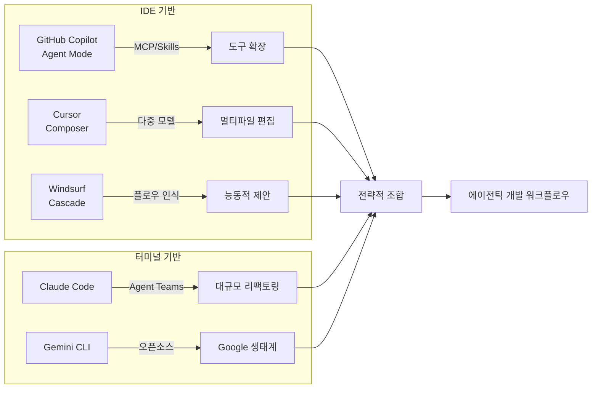
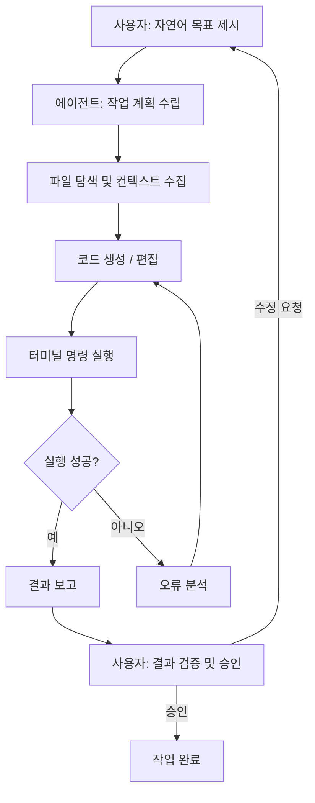
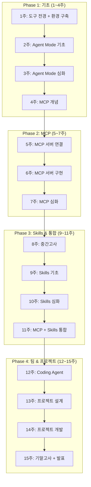

# 1주차. AI 코딩 도구 전경과 개발 환경 구축

> **1회차** (강의 90분): AI 코딩 도구 전경, 에이전틱 코딩의 개념, 바이브 코딩의 가능성과 한계
> **2회차** (실습 90분): VS Code + Copilot 설치·설정, GitHub Student Pack 등록, 첫 Copilot 대화

---

## 학습목표

1. 주요 AI 코딩 도구(GitHub Copilot, Claude Code, Cursor, Windsurf, Gemini CLI)의 특성과 전략적 위치를 비교·설명할 수 있다
2. 에이전틱 코딩(Agentic Coding)의 개념을 정의하고, 기존 자동완성 방식과의 차이를 구별할 수 있다
3. 바이브 코딩(Vibe Coding)의 가능성과 한계를 실무 사례를 통해 판단할 수 있다
4. VS Code + GitHub Copilot 실습 환경을 완성하고, 첫 AI 대화를 수행할 수 있다

## 선수지식

Python 또는 JavaScript 중 한 가지 이상의 프로그래밍 언어를 사용해 본 경험이 있으면 충분하다. 복잡한 프레임워크 지식은 필요하지 않으며, 변수 선언, 조건문, 함수 작성 수준의 기초 문법을 이해하고 있으면 된다. VS Code를 설치하여 파일을 열고 편집한 경험이 있으면 이상적이나, 다른 편집기 사용자도 수업을 따라오는 데 어려움이 없다. Git의 기본 개념(커밋, 푸시, 풀)을 이해하고 있으면 2회차 실습에서 도움이 된다.

---

## 1회차: 강의

### 1.1 AI 코딩 도구의 현재

2024년 말부터 2026년 초에 이르기까지, AI 코딩 도구 시장은 단순한 코드 자동완성 단계를 넘어 "자율적 소프트웨어 개발"이라는 새로운 국면에 진입하였다. 2021년 GitHub Copilot이 처음 등장했을 때, 대부분의 개발자는 이를 "더 똑똑한 자동완성"으로 인식하였다. 커서 위치에서 다음 줄을 제안하는 인라인 완성(Inline Completion)이 핵심 기능이었기 때문이다. 그러나 5년이 지난 현재, AI 코딩 도구는 프로젝트 전체를 탐색하고, 하위 작업을 계획하며, 터미널 명령을 실행하고, 오류를 자동으로 수정하는 수준에 도달하였다.

이 변화를 이해하려면 현재 시장의 주요 도구를 체계적으로 살펴볼 필요가 있다. 각 도구는 서로 다른 철학과 아키텍처를 바탕으로 진화해 왔으며, 개발자는 이들의 강점과 약점을 파악하여 상황에 맞게 선택하거나 조합하는 판단력을 갖추어야 한다.

#### GitHub Copilot Agent Mode

GitHub Copilot은 IDE 기반 AI 코딩 도구의 대표 주자이다. VS Code 확장(Extension)으로 동작하며, 2025년 중반 정식 출시된 에이전트 모드(Agent Mode)를 통해 자율적 다단계 개발이 가능해졌다. 에이전트 모드에서 Copilot은 사용자의 자연어 지시를 받아 파일 탐색, 코드 생성, 터미널 명령 실행, 오류 수정을 자율적으로 수행한다. 이 자율 실행 루프(Agentic Loop)는 사용자가 목표만 제시하면 나머지를 Copilot이 판단하여 처리한다는 점에서, 기존의 Ask(질문) 모드나 Edit(편집) 모드와 근본적으로 다르다.

Copilot의 가장 큰 강점은 생태계 통합에 있다. GitHub라는 세계 최대 코드 호스팅 플랫폼 위에 구축되어 있으므로, 리포지토리 컨텍스트, 이슈, 풀 리퀘스트, GitHub Actions와 자연스럽게 연결된다. 2025년 하반기에 도입된 Coding Agent는 GitHub 이슈를 할당하면 자동으로 브랜치를 생성하고, 코드를 작성하며, 풀 리퀘스트를 올리는 수준까지 발전하였다. 또한 MCP(Model Context Protocol) 지원을 통해 외부 도구와의 연결이 표준화되었으며, Skills 파일을 통한 도메인 지식 주입이 가능하다.

약점으로는 터미널 기반 작업에서의 한계가 있다. Copilot은 VS Code 내부에서 동작하므로, 대규모 리팩토링이나 복잡한 셸 스크립팅 작업에서는 IDE의 제약을 받는다. 또한 에이전트 모드에서 생성된 코드의 품질은 프롬프트의 구체성에 크게 의존하며, 보안 관련 코드(인증, 입력 검증 등)는 종종 불완전하게 생성되는 경향이 있다.

#### Claude Code

Claude Code는 Anthropic이 개발한 터미널 기반 AI 코딩 도구이다. IDE에 종속되지 않고 커맨드라인에서 직접 실행되므로, 개발자가 기존에 사용하던 터미널 워크플로우에 자연스럽게 통합된다. Claude Code의 핵심 철학은 "터미널이 곧 개발 환경"이라는 전제에서 출발한다.

Claude Code의 가장 두드러진 강점은 대규모 코드베이스에 대한 멀티스텝 리팩토링 능력이다. 수십 개의 파일에 걸친 구조적 변경을 계획하고, 각 파일을 순차적으로 수정하며, 변경 간의 일관성을 유지하는 작업에서 강력한 성능을 보여 준다. 또한 Agent Teams 기능을 통해 여러 Claude Code 인스턴스가 병렬로 작업을 수행할 수 있으며, 이는 대규모 프로젝트에서 상당한 생산성 향상을 가져온다. GitHub, GitLab과의 통합도 지원하여 이슈 기반 자동 PR 생성이 가능하다.

터미널 기반이라는 특성상, GUI를 선호하는 개발자에게는 진입 장벽이 존재한다. 또한 파일 편집의 시각적 피드백이 IDE에 비해 제한적이므로, 코드 변경 사항을 확인하려면 별도의 diff 도구나 에디터를 함께 사용해야 하는 경우가 있다.

#### Cursor Composer

Cursor는 VS Code를 포크(Fork)하여 AI 기능을 핵심에 내장한 전용 IDE이다. 확장으로 AI를 추가하는 방식이 아니라 편집기 자체가 AI를 중심으로 설계되었다는 점에서 근본적인 차이가 있다. Cursor의 Composer 모드는 멀티파일 편집을 지원하는 에이전틱 기능으로, 프로젝트 전체의 컨텍스트를 활용하여 여러 파일에 걸친 변경을 동시에 수행한다.

Cursor의 강점은 컨텍스트 관리의 정교함에 있다. 코드베이스 인덱싱을 통해 프로젝트 전체의 구조를 파악하고, 관련 파일을 자동으로 찾아 참조한다. 또한 여러 AI 모델(Claude, GPT, Gemini 등)을 자유롭게 선택할 수 있어, 작업의 성격에 따라 최적의 모델을 사용할 수 있다. 빠른 편집을 위한 Tab 기반 자동완성과 심층적인 분석을 위한 Composer 모드가 공존하여, 단순 작업과 복합 작업 모두에 효과적이다.

다만 Cursor는 VS Code 포크이므로 VS Code의 업데이트를 따라가는 데 시간 차이가 발생할 수 있으며, VS Code의 일부 확장이 호환되지 않는 경우가 있다. 유료 구독 모델(Pro, Business)이 기본이므로 비용 요인도 고려해야 한다.

#### Windsurf Cascade

Windsurf(구 Codeium)는 "플로우(Flow)" 개념을 중심으로 설계된 AI 코딩 도구이다. Cascade라 불리는 에이전틱 기능은 개발자의 작업 흐름을 실시간으로 추적하여, 다음에 필요한 작업을 능동적으로 제안한다. 코드를 작성하는 도중에도 Cascade가 관련 파일의 변경을 감지하고, 이에 맞춰 다른 파일의 수정을 제안하는 방식이다.

Windsurf의 차별점은 능동적 맥락 인식(Proactive Context Awareness)에 있다. 개발자가 명시적으로 지시하지 않아도 작업의 의도를 파악하고, 관련된 코드 변경을 미리 준비한다. 이 접근 방식은 "묻기 전에 답한다"는 철학으로 요약할 수 있다.

#### Gemini CLI

Gemini CLI는 Google이 제공하는 터미널 기반 AI 코딩 도구로, 오픈소스로 공개되어 있다. Claude Code와 유사하게 커맨드라인에서 동작하며, Google의 Gemini 모델을 기반으로 한다. 무료 티어에서도 상당한 사용량을 제공하므로 학습 목적으로 접근성이 높다. MCP 서버 연결을 지원하여 외부 도구와의 통합이 가능하며, Google Cloud 생태계와의 연동에서 강점을 가진다.

#### 전략적 비교와 조합

이상의 도구들은 크게 세 가지 범주로 분류할 수 있다.

**표 1.1** AI 코딩 도구의 범주별 분류

| 범주 | 도구 | 핵심 특성 | 최적 사용처 |
|------|------|----------|------------|
| IDE 내장형 | GitHub Copilot (VS Code) | 생태계 통합, MCP/Skills 지원, Coding Agent | GitHub 기반 팀 개발, 단계적 에이전트 도입 |
| AI 네이티브 IDE | Cursor, Windsurf | AI 중심 설계, 다중 모델 지원, 정교한 컨텍스트 | 개인 생산성 극대화, 멀티파일 편집 중심 작업 |
| 터미널 기반 | Claude Code, Gemini CLI | IDE 독립, 대규모 리팩토링, 셸 통합 | 대규모 코드베이스, CI/CD 파이프라인, 자동화 |

실무에서 가장 효과적인 접근은 단일 도구에 의존하는 것이 아니라, 상황에 따라 도구를 전략적으로 조합하는 것이다. 예를 들어, 프로젝트의 초기 구조를 GitHub Copilot Agent Mode로 잡고, 세부적인 멀티파일 리팩토링은 Claude Code로 수행하며, 빠른 편집과 탐색은 Cursor의 Tab 완성을 활용하는 방식이다. 이 과목에서는 GitHub Copilot을 주 도구로 사용하되, 각 도구의 강점을 이해하여 적재적소에 활용하는 판단력을 함께 기른다.


**그림 1.1** AI 코딩 도구의 범주와 전략적 조합

---

### 1.2 에이전틱 코딩이란 무엇인가

에이전틱 코딩(Agentic Coding)이란 AI가 단순한 코드 제안을 넘어, 목표를 해석하고 다단계 작업을 자율적으로 계획·실행·검증하는 소프트웨어 개발 방식을 말한다. 이 용어는 2024년 후반부터 본격적으로 사용되기 시작하였으며, AI 코딩 도구가 "수동적 보조자"에서 "능동적 협업자"로 진화한 전환점을 표현한다.

#### 자동완성에서 에이전트로의 진화

AI 코딩 도구의 발전 단계를 살펴보면 에이전틱 코딩의 본질이 더 명확해진다.

**표 1.2** AI 코딩 도구의 발전 단계

| 단계 | 시기 | 대표 기능 | AI의 역할 | 사람의 역할 |
|------|------|----------|----------|------------|
| 1세대 | 2021-2022 | 인라인 자동완성 | 다음 줄 제안 | 제안 수락/거부 |
| 2세대 | 2023-2024 | 채팅 기반 코드 생성 | 질문에 답변, 코드 블록 생성 | 코드 복사, 수동 적용 |
| 3세대 | 2025-현재 | 에이전틱 모드 | 다단계 자율 실행, 오류 자동 수정 | 목표 설정, 결과 검증, 승인 |

1세대에서 AI는 커서 위치의 맥락을 읽고 다음 코드 줄을 제안하는 역할에 머물렀다. 개발자가 Tab 키를 눌러 제안을 수락하거나 무시하는 것이 상호작용의 전부였다. 2세대에서는 채팅 인터페이스가 도입되어 "이 함수를 리팩토링해 줘"와 같은 자연어 요청이 가능해졌으나, 생성된 코드를 개발자가 직접 복사하여 적절한 위치에 붙여넣어야 했다.

3세대, 즉 에이전틱 코딩 단계에서는 근본적인 전환이 일어났다. AI가 단일 코드 블록이 아니라 프로젝트 전체를 작업 대상으로 삼게 된 것이다. 에이전트는 파일 시스템을 탐색하고, 여러 파일에 걸쳐 코드를 수정하며, 터미널에서 명령을 실행하고, 실행 결과의 오류를 감지하여 자동으로 수정을 시도한다. 이 전체 과정이 하나의 자율 실행 루프(Agentic Loop)로 동작한다.


**그림 1.2** 에이전틱 코딩의 자율 실행 루프

#### 에이전틱 코딩의 핵심 특성

에이전틱 코딩을 기존 AI 코딩 보조와 구분 짓는 핵심 특성은 네 가지이다.

첫째, **자율적 계획 수립(Autonomous Planning)**이다. 에이전트는 사용자의 목표를 받아 하위 작업으로 분해하고, 실행 순서를 스스로 결정한다. "Flask 웹앱을 만들어 줘"라는 지시를 받으면, 프로젝트 구조 설계, 라우트 작성, 템플릿 생성, 의존성 설치, 서버 실행이라는 하위 작업을 자동으로 도출한다.

둘째, **도구 사용(Tool Use)**이다. 에이전트는 파일 읽기/쓰기, 터미널 명령 실행, 웹 검색, 외부 API 호출 등 다양한 도구를 상황에 맞게 선택하여 사용한다. MCP(Model Context Protocol)는 이러한 도구 사용을 표준화하는 프로토콜로, 4주차에서 본격적으로 다룬다.

셋째, **자기 수정(Self-Correction)**이다. 코드 실행에서 오류가 발생하면 에이전트는 오류 메시지를 분석하고, 원인을 추론하여, 코드를 수정한 뒤 재실행한다. 이 자기 수정 루프는 여러 차례 반복될 수 있으며, 사람이 개입하지 않아도 상당수의 일반적 오류가 해결된다.

넷째, **멀티파일 맥락 유지(Multi-file Context)**이다. 에이전트는 단일 파일이 아니라 프로젝트 전체를 작업의 맥락으로 유지한다. 한 파일의 인터페이스를 변경하면 이를 참조하는 다른 파일들도 함께 수정하는 식이다. 이 능력은 대규모 리팩토링에서 특히 중요하다.

#### 에이전틱 코딩에서 사람의 역할

에이전틱 코딩이 도입되었다고 해서 개발자의 역할이 사라지는 것은 아니다. 오히려 역할의 성격이 "코드를 직접 작성하는 사람"에서 "목표를 설정하고 결과를 검증하는 사람"으로 변화한다. 이 변화를 정리하면 다음과 같다.

**표 1.3** 에이전틱 코딩에서의 역할 분담

| 영역 | AI 에이전트가 수행 | 사람이 수행 |
|------|-------------------|------------|
| 목표 설정 | - | 요구사항 정의, 제약 조건 명시 |
| 설계 판단 | 구현 수준 설계 제안 | 아키텍처 결정, 트레이드오프 판단 |
| 코드 작성 | 코드 생성, 반복 패턴 구현 | 핵심 로직 검증, 엣지 케이스 확인 |
| 테스트 | 단위 테스트 생성, 실행 | 테스트 전략 설계, 경계값 검증 |
| 디버깅 | 오류 분석 및 자동 수정 | 논리적 오류 판단, 근본 원인 분석 |
| 보안 | 기본 패턴 적용 | 보안 요구사항 정의, 취약점 감사 |
| 배포 | 설정 파일 생성 | 배포 전략 결정, 운영 모니터링 |

이 역할 분담에서 주목할 점은, AI가 "어떻게(How)"를 담당하고 사람이 "무엇을(What)"과 "왜(Why)"를 담당한다는 것이다. 좋은 프롬프트를 작성하는 능력, 생성된 코드의 품질을 판단하는 능력, 그리고 AI가 놓친 엣지 케이스를 식별하는 능력이 에이전틱 코딩 시대의 핵심 개발자 역량이 된다.

---

### 1.3 바이브 코딩의 가능성과 한계

#### 바이브 코딩이란 무엇인가

"바이브 코딩(Vibe Coding)"은 2025년 2월 Andrej Karpathy가 처음 사용한 용어로, 개발자가 코드를 직접 작성하는 대신 자연어로 원하는 바를 설명하고, AI가 코드를 생성하며, 개발자는 결과의 "분위기(vibe)"만 확인하여 수락하거나 수정 요청을 하는 개발 방식을 말한다. Karpathy는 이를 "코드를 보지 않고, AI가 만든 것을 그냥 받아들이며, 동작하면 넘어가는" 방식으로 묘사하였다.

바이브 코딩의 핵심은 코드의 내부 구조에 대한 이해 없이도 동작하는 소프트웨어를 만들 수 있다는 전제에 있다. 이것은 프로그래밍의 민주화라는 관점에서 혁명적인 가능성을 지니면서도, 소프트웨어 공학의 근본 원칙과 충돌하는 심각한 문제를 내포하고 있다.

#### 바이브 코딩이 효과적인 영역

바이브 코딩이 실제로 효과를 발휘하는 영역은 분명히 존재한다.

**프로토타이핑과 개념 검증(PoC)**에서 바이브 코딩은 가장 강력한 효과를 보인다. "이 아이디어가 기술적으로 가능한가?"라는 질문에 대한 답을 며칠이 아닌 몇 시간 만에 얻을 수 있다. 스타트업의 MVP(Minimum Viable Product) 개발, 해커톤, 사내 데모 등에서 바이브 코딩은 시간 대비 산출물의 양에서 압도적인 우위를 가진다.

**일회성 스크립트와 자동화**에서도 바이브 코딩은 효과적이다. CSV 파일을 정리하거나, 이미지 크기를 일괄 변환하거나, 특정 패턴의 로그를 추출하는 등의 단발성 작업에서는 코드의 장기 유지보수가 필요하지 않으므로, AI가 생성한 코드를 세밀하게 검토하지 않아도 실용적 가치가 충분하다.

**학습과 탐색**에서 바이브 코딩은 새로운 기술이나 라이브러리를 빠르게 체험하는 수단이 된다. "FastAPI로 간단한 REST API를 만들어 줘"라고 요청하면, 프레임워크의 기본 구조와 관례를 코드로 확인할 수 있다. 공식 문서를 읽기 전에 동작하는 예제를 먼저 보는 것이 학습에 효과적인 경우가 많다.

#### 바이브 코딩이 실패하는 영역

그러나 바이브 코딩은 소프트웨어 개발의 상당 부분에서 심각한 한계를 드러낸다.

첫째, **보안이 중요한 시스템**에서 바이브 코딩은 위험하다. AI가 생성한 인증 코드가 SQL 인젝션에 취약하거나, API 키가 클라이언트 사이드에 노출되거나, CSRF 토큰이 누락되는 사례는 빈번하게 보고되고 있다. "동작한다"는 사실이 "안전하다"는 것을 보장하지 않는다. 보안 취약점은 기능적 테스트로 드러나지 않기 때문에, 코드를 읽지 않는 바이브 코딩 방식에서는 발견 자체가 불가능하다.

둘째, **유지보수가 필요한 코드**에서 바이브 코딩은 기술 부채(Technical Debt)를 급속히 누적시킨다. AI가 생성한 코드를 이해하지 못한 채 수락한 개발자는, 버그가 발생했을 때 디버깅할 수 없다. 변수명, 함수 구조, 모듈 분리 등 코드 품질의 세부 사항을 검토하지 않으면, 프로젝트가 성장할수록 수정 비용이 기하급수적으로 증가한다.

셋째, **복잡한 비즈니스 로직**에서 바이브 코딩은 논리적 오류를 만들어 낸다. AI는 일반적인 패턴은 잘 생성하지만, 도메인 고유의 규칙(예: "연속 3일 이상 초과근무 시 다음 날 자동 휴무 배정")을 정확하게 구현하는 데 한계가 있다. 이러한 규칙은 자연어로 설명하기 어려운 미묘한 조건 분기를 포함하는 경우가 많으며, AI가 잘못 해석하더라도 기능적으로는 동작하는 것처럼 보일 수 있다.

#### 에이전틱 코딩과 바이브 코딩의 차이

에이전틱 코딩과 바이브 코딩은 AI를 활용한 개발이라는 공통점을 가지지만, 근본적인 차이가 있다.

**표 1.4** 에이전틱 코딩과 바이브 코딩의 비교

| 항목 | 에이전틱 코딩 | 바이브 코딩 |
|------|-------------|------------|
| 코드 이해 | 필수 (개발자가 생성 코드를 검증) | 선택 (결과만 확인) |
| 검증 수준 | 기능 + 보안 + 코드 품질 | 기능 동작 여부만 확인 |
| 적용 범위 | 프로덕션 코드 포함 | 프로토타입, 일회성 작업 중심 |
| 개발자 역량 | 설계·검증·판단 능력 필요 | 자연어 설명 능력 중심 |
| 기술 부채 | 통제 가능 | 급속 누적 위험 |
| 이 과목의 지향 | 에이전틱 코딩 | - |

이 과목에서 지향하는 것은 에이전틱 코딩이다. AI를 적극적으로 활용하되, 생성된 코드를 이해하고 검증하며, 설계 판단은 사람이 주도하는 방식이다. 바이브 코딩의 빠른 생산성을 프로토타이핑 단계에서 활용하면서도, 프로덕션 코드에서는 반드시 사람의 검증을 거치는 균형 잡힌 접근을 추구한다.

---

### 1.4 이 과목에서 배울 것

이 과목은 15주에 걸쳐 GitHub Copilot을 중심으로 AI 에이전트 개발의 전체 흐름을 학습한다. 단순히 AI 도구의 사용법을 익히는 데 그치지 않고, 도구를 확장하는 표준(MCP), 도메인 지식을 주입하는 방법(Skills), 팀 워크플로우에 통합하는 전략(Coding Agent)까지 단계적으로 발전시켜 나간다.

#### 전체 로드맵

과목의 진행은 네 가지 단계(Phase)로 구성된다.

**Phase 1: 기초 (1~4주)**에서는 AI 코딩 도구의 전경을 파악하고, Copilot의 에이전트 모드를 깊이 있게 체험한 뒤, MCP의 개념과 아키텍처를 이해한다. 이 단계의 목표는 "AI와 함께 코딩하는 것"에 익숙해지는 것이다.

**Phase 2: MCP (5~7주)**에서는 기존 MCP 서버를 연결하여 Copilot의 능력을 확장하고, Python SDK로 자체 MCP 서버를 구현하며, 프로덕션 수준의 에러 처리와 테스트를 적용한다. 이 단계의 목표는 "AI가 사용할 수 있는 도구를 직접 만드는 것"이다.

**Phase 3: Skills & 통합 (9~11주)**에서는 SKILL.md 파일로 Copilot에 도메인 지식과 절차를 주입하고, MCP 서버와 Skills를 조합하여 실무 자동화 에이전트를 완성한다. 이 단계의 목표는 "AI에게 무엇을 어떻게 해야 하는지 가르치는 것"이다.

**Phase 4: 팀 & 프로젝트 (12~15주)**에서는 Coding Agent를 활용한 팀 워크플로우 자동화를 학습하고, 최종 프로젝트를 통해 전체 과정을 통합한다.


**그림 1.3** 15주 과목 로드맵

#### 핵심 역량의 축적 구조

각 Phase에서 쌓이는 역량은 다음 단계의 기반이 된다. Agent Mode를 이해해야 MCP가 왜 필요한지 알 수 있고, MCP 서버를 만들어야 Skills와 통합할 수 있으며, 이 모든 것을 갖추어야 비로소 팀 수준의 에이전트 워크플로우를 설계할 수 있다. 따라서 각 주차의 과제는 단순 기능 구현이 아니라, 이전 주차에서 배운 개념을 현재 주차의 작업에 적용하는 누적 구조로 설계되어 있다.

**표 1.5** Phase별 핵심 질문과 산출물

| Phase | 핵심 질문 | 주요 산출물 |
|-------|----------|------------|
| 1: 기초 | AI 코딩 도구는 어디까지 할 수 있는가? | Agent Mode로 생성한 웹앱, MCP 아키텍처 다이어그램 |
| 2: MCP | AI에게 새로운 도구를 어떻게 제공하는가? | MCP 서버 3종 연결, 커스텀 MCP 서버 구현 |
| 3: Skills | AI에게 도메인 지식을 어떻게 가르치는가? | SKILL.md, MCP+Skills 통합 에이전트 |
| 4: 팀 | AI를 팀 워크플로우에 어떻게 통합하는가? | Coding Agent 워크플로우, 최종 프로젝트 |

이 과목을 마칠 때 수강생은 "AI 코딩 도구를 사용할 수 있는 사람"이 아니라, "AI 에이전트가 사용할 도구와 지식을 설계하고, 이를 팀 워크플로우에 통합할 수 있는 사람"이 되는 것을 목표로 한다.

---

## 2회차: 실습

### 실습 1: 개발 환경 구축

이 실습에서는 이 과목의 전체 15주 동안 사용할 개발 환경을 구축한다. 환경이 올바르게 설정되지 않으면 이후 모든 실습에 영향을 미치므로, 각 단계를 꼼꼼하게 확인하며 진행한다.

#### 단계 1: VS Code 설치 및 버전 확인

VS Code 공식 사이트(https://code.visualstudio.com/)에서 운영체제에 맞는 최신 버전을 다운로드하여 설치한다. 이미 설치되어 있는 경우 "Help > Check for Updates"를 통해 최신 버전으로 갱신한다. 에이전트 모드와 Skills 기능의 완전한 지원을 위해 버전 1.102 이상이 필요하며, 가능하다면 VS Code Insiders 채널(https://code.visualstudio.com/insiders/)을 사용하는 것을 권장한다.

설치 후 터미널에서 다음 명령으로 버전을 확인한다.

```bash
code --version
```

출력된 버전 번호가 1.102 이상인지 확인한다.

#### 단계 2: GitHub 계정 및 Student Developer Pack 등록

GitHub 계정이 없는 경우 https://github.com 에서 계정을 생성한다. 이미 계정이 있는 경우 로그인 상태를 확인한다.

학생 신분인 경우 GitHub Student Developer Pack(https://education.github.com/pack)에 등록하면 Copilot Pro를 무료로 사용할 수 있다. 등록 절차는 다음과 같다.

1. GitHub Education 페이지에 접속하여 "Get your Pack" 버튼을 클릭한다
2. 학교 이메일(.ac.kr 또는 .edu) 주소를 입력하고 인증한다
3. 학생 신분을 증명하는 서류(학생증 사진 등)를 업로드한다
4. 승인까지 통상 1~7일이 소요된다

승인이 완료되면 GitHub 계정의 Settings > Copilot 페이지에서 Copilot이 활성화된 것을 확인할 수 있다. Student Pack 승인이 아직 완료되지 않은 경우, Copilot Free 플랜(월 2,000회 코드 완성, 50회 채팅)을 우선 사용하고 승인 후 Pro로 전환한다.

#### 단계 3: Copilot 확장 설치

VS Code를 열고, 좌측 사이드바의 확장(Extensions) 아이콘을 클릭하거나 Ctrl+Shift+X(macOS: Cmd+Shift+X)를 누른다. 검색창에 "GitHub Copilot"을 입력하여 다음 두 가지 확장을 설치한다.

- **GitHub Copilot**: 인라인 코드 완성 기능을 제공한다
- **GitHub Copilot Chat**: 채팅 인터페이스, Ask/Edit/Agent 모드를 제공한다

설치 후 VS Code 하단 상태바에 Copilot 아이콘이 나타나는지 확인한다. 아이콘에 경고 표시가 있다면 GitHub 계정 로그인이 필요하다. 좌측 하단의 계정 아이콘을 클릭하여 GitHub 계정으로 로그인한다.

#### 단계 4: Python 및 Node.js 환경 확인

이 과목의 실습에서는 Python과 Node.js를 모두 사용한다. Python은 MCP 서버 구현에, Node.js는 일부 MCP 서버 실행(npx)에 필요하다. 터미널에서 다음 명령으로 설치 상태를 확인한다.

```bash
python3 --version    # 3.10 이상 필요
node --version       # 18 이상 필요
npm --version        # Node.js와 함께 설치됨
git --version        # Git 설치 확인
```

Python이 설치되어 있지 않은 경우 https://www.python.org/ 에서, Node.js가 설치되어 있지 않은 경우 https://nodejs.org/ 에서 각각 다운로드하여 설치한다. macOS 사용자는 Homebrew(`brew install python node`)를 사용하면 편리하다.

#### 단계 5: 에이전트 모드 활성화 확인

VS Code의 설정(Ctrl+, 또는 Cmd+,)에서 "chat.agent.enabled"를 검색하여 이 설정이 활성화되어 있는지 확인한다. 활성화되어 있으면 Copilot Chat 패널(Ctrl+Shift+I 또는 Cmd+Shift+I)의 모드 선택 드롭다운에서 "Agent" 옵션이 나타난다.

#### 환경 구축 완료 체크리스트

모든 단계를 마친 후 다음 항목을 확인한다.

| 항목 | 확인 명령 / 방법 | 기대 결과 |
|------|-----------------|----------|
| VS Code 버전 | `code --version` | 1.102 이상 |
| Copilot 확장 | 확장 목록 확인 | GitHub Copilot + Chat 설치됨 |
| GitHub 로그인 | 하단 상태바 Copilot 아이콘 | 경고 없이 활성화 |
| Python | `python3 --version` | 3.10 이상 |
| Node.js | `node --version` | 18 이상 |
| Git | `git --version` | 설치 확인 |
| Agent 모드 | Copilot Chat 모드 선택 | "Agent" 옵션 표시 |

---

### 실습 2: 첫 Copilot 대화

환경 구축이 완료되었으면, Copilot과의 첫 대화를 통해 세 가지 상호작용 모드의 차이를 직접 체험한다.

#### Ask 모드 체험

먼저 아무 Python 파일을 하나 만들어 간단한 코드를 작성한다. 예를 들어 `hello.py`라는 파일에 다음 코드를 입력한다.

```python
def fibonacci(n):
    if n <= 1:
        return n
    return fibonacci(n - 1) + fibonacci(n - 2)

result = fibonacci(10)
print(f"fibonacci(10) = {result}")
```

Copilot Chat을 열고(Ctrl+Shift+I 또는 Cmd+Shift+I) 모드를 "Ask"로 선택한 뒤, 다음과 같이 질문한다.

```
이 fibonacci 함수의 시간 복잡도는 얼마인가요?
```

Copilot은 재귀 호출 구조를 분석하여 시간 복잡도가 O(2^n)임을 설명하고, 이를 개선할 수 있는 방법(메모이제이션, 반복문 등)을 제안할 것이다. Ask 모드에서는 파일이 변경되지 않으며, 코드에 대한 이해를 돕는 읽기 전용 상호작용임을 확인한다.

#### Edit 모드 체험

같은 파일을 열어 둔 상태에서 모드를 "Edit"으로 전환하고, 다음과 같이 요청한다.

```
이 fibonacci 함수를 메모이제이션을 사용하도록 개선해 줘
```

Copilot은 파일 내용을 직접 수정하여 `functools.lru_cache` 데코레이터를 추가하거나, 딕셔너리 기반 메모이제이션 코드를 작성한다. 변경 사항이 diff 형태로 표시되며, 수락 또는 거부를 선택할 수 있다. Edit 모드에서는 사용자가 지정한 파일의 범위 내에서 변경이 이루어진다는 점을 확인한다.

#### Agent 모드 체험

이제 모드를 "Agent"로 전환하고, 보다 복합적인 요청을 해 본다.

```
피보나치 수열의 처음 20개 항을 계산하고, 결과를 CSV 파일로 저장하는 스크립트를 만들어 줘. 실행까지 해 줘.
```

Agent 모드에서 Copilot은 다음과 같은 단계를 자율적으로 수행한다. 먼저 새로운 Python 파일을 생성하고, 피보나치 계산 함수와 CSV 저장 로직을 작성한다. 이어서 터미널에서 스크립트를 실행하려고 시도하며, 이 때 "Allow" 버튼으로 사용자 승인을 요청한다. 승인하면 스크립트가 실행되고, CSV 파일이 생성되며, Copilot이 결과를 보고한다. 만약 실행 도중 오류가 발생하면 자동으로 코드를 수정하고 재실행을 시도한다.

세 가지 모드의 차이를 직접 체험한 뒤, 다음 사항을 노트에 기록한다.

1. Ask/Edit/Agent 각 모드에서 Copilot이 수행한 작업의 범위는 어떻게 달랐는가?
2. Agent 모드에서 사용자 승인(Allow)이 요청된 시점은 언제였는가?
3. 생성된 코드에서 개선이 필요한 부분이 있었는가? (있다면 구체적으로 무엇인가?)

이 기록은 과제 제출의 일부가 된다.

---

## 과제

**제출 항목**: 다음 두 가지를 GitHub 리포지토리에 제출한다.

1. **환경 구축 스크린샷** (3장)
   - VS Code에서 Copilot 확장이 설치되고 활성화된 화면
   - 터미널에서 Python, Node.js, Git 버전을 확인한 화면
   - Copilot Chat에서 Agent 모드가 선택 가능한 화면

2. **첫 Copilot 대화 결과**
   - 실습 2에서 수행한 세 가지 모드(Ask/Edit/Agent) 대화의 스크린샷 또는 텍스트 기록
   - 각 모드에서 관찰한 차이점을 정리한 간단한 메모 (5줄 이상)

**제출 기한**: 2회차 수업 종료 후 1주일 이내

**평가 기준**: 환경 구축 완료 여부(50%), Copilot 대화 수행 여부(30%), 관찰 기록의 구체성(20%)

---

## 핵심 정리

- AI 코딩 도구는 IDE 내장형(GitHub Copilot), AI 네이티브 IDE(Cursor, Windsurf), 터미널 기반(Claude Code, Gemini CLI)의 세 범주로 나뉘며, 각각 고유한 강점을 가진다
- 에이전틱 코딩은 AI가 자율적으로 계획·실행·수정하는 개발 방식이며, 자동완성과 근본적으로 다르다
- 에이전틱 코딩에서 사람의 역할은 "코드 작성"에서 "목표 설정과 결과 검증"으로 전환된다
- 바이브 코딩은 프로토타이핑에 효과적이나, 보안·유지보수·복잡한 로직에서는 심각한 한계가 있다
- 이 과목은 Agent Mode에서 출발하여 MCP, Skills, Coding Agent까지 단계적으로 역량을 쌓아 간다

---

## 참고 자료

### 공식 문서
- GitHub Copilot Documentation. https://docs.github.com/en/copilot
- VS Code Copilot Agent Mode. https://code.visualstudio.com/docs/copilot/chat/chat-agent-mode
- GitHub Student Developer Pack. https://education.github.com/pack

### 도구별 공식 사이트
- Claude Code. https://docs.anthropic.com/en/docs/claude-code
- Cursor. https://www.cursor.com
- Windsurf. https://windsurf.com
- Gemini CLI. https://github.com/google-gemini/gemini-cli

### 핵심 참고 자료
- Karpathy, A. (2025). "Vibe Coding." https://x.com/karpathy/status/1886192184808149383
- GitHub Blog. (2025). "GitHub Copilot: The agent awakens." https://github.blog/news-insights/product-news/github-copilot-the-agent-awakens/

---

## 다음 주 예고

2주차에서는 GitHub Copilot의 에이전트 모드(Agent Mode)를 본격적으로 다룬다. 세 가지 모드(Ask/Edit/Agent)의 동작 원리를 정밀하게 비교하고, 에이전트 모드의 자율 실행 루프가 내부적으로 어떻게 동작하는지 분석한다. 2회차 실습에서는 자연어 한 문장으로 Flask Todo 웹앱을 처음부터 끝까지 생성하고, 에이전트가 생성한 코드를 사람이 검증해야 하는 지점을 식별하는 실전 경험을 쌓는다.
