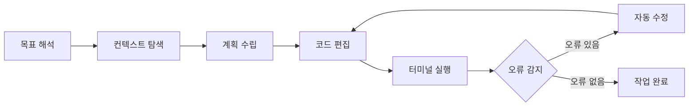

# 제1강. Copilot Agent Mode 실전

## 학습목표

- GitHub Copilot의 에이전트 모드(Agent Mode)가 무엇인지 이해한다
- 에이전트 모드의 자율 실행 루프(계획 -> 편집 -> 실행 -> 수정)를 직접 체험한다
- 에이전트 모드가 효과적인 상황과 한계를 판별한다

## 선수지식

VS Code 기본 사용법과 파이썬 또는 자바스크립트 등 한 가지 이상의 프로그래밍 언어 경험이 있으면 충분하다. GitHub 계정이 필요하며, GitHub Student Developer Pack 또는 Copilot Pro 구독이 활성화되어 있어야 한다.

---

## 1.1 에이전트 모드란 무엇인가

GitHub Copilot은 2021년 기술 프리뷰 이후 꾸준히 진화해 왔다. 초기에는 편집기 안에서 다음 줄을 제안하는 인라인 자동완성(Inline Completion)이 전부였다. 이후 Copilot Chat이 추가되어 코드에 관한 질문과 답변이 가능해졌고, 2025년 중반 정식 출시(GA)된 에이전트 모드(Agent Mode)는 이 흐름의 결정적 전환점이다.

에이전트 모드의 핵심은 자율성에 있다. 기존 모드에서 Copilot은 사용자가 지정한 파일의 특정 위치에 코드를 제안하는 수동적 역할을 수행했다. 에이전트 모드에서는 사용자가 자연어로 목표를 기술하면, Copilot이 스스로 관련 파일을 탐색하고, 하위 작업을 계획하며, 여러 파일에 걸친 편집을 제안하고, 터미널 명령을 실행하며, 오류가 발생하면 자동으로 수정을 시도한다. 이 전체 과정이 하나의 자율 실행 루프(Agentic Loop)로 동작한다.

VS Code에서 Copilot Chat 패널을 열면 세 가지 상호작용 모드를 선택할 수 있다.

**표 1.1** Copilot Chat의 세 가지 상호작용 모드

| 모드 | 역할 | 동작 범위 |
|------|------|----------|
| Ask(질문) | 코드에 관한 질문에 답변한다 | 읽기 전용, 파일 변경 없음 |
| Edit(편집) | 지정한 파일에 변경을 적용한다 | 사용자가 지정한 파일 범위 |
| Agent(에이전트) | 목표를 해석하여 자율적으로 다단계 작업을 수행한다 | 프로젝트 전체, 터미널 포함 |

Ask 모드는 "이 함수가 무엇을 하는가?"처럼 이해를 돕는 질문에 적합하다. Edit 모드는 "이 파일의 변수명을 카멜케이스로 바꿔 줘"처럼 범위가 명확한 편집에 효과적이다. Agent 모드는 "Flask로 할 일 목록 웹앱을 만들어 줘"처럼 여러 파일 생성과 실행이 필요한 복합 작업에서 진가를 발휘한다.

세 모드는 배타적 관계가 아니라 상호 보완적이다. 에이전트 모드로 프로젝트의 큰 틀을 잡은 뒤, Edit 모드로 특정 파일의 세부 사항을 조정하고, Ask 모드로 코드의 동작 원리를 확인하는 식으로 조합하여 사용하는 것이 가장 효과적인 워크플로우이다. 이 강의에서는 에이전트 모드에 집중하되, 필요한 시점에 다른 모드로 전환하는 판단력도 함께 기른다.

---

## 1.2 환경 설정

에이전트 모드를 사용하려면 몇 가지 사전 준비가 필요하다.

첫째, VS Code 버전을 확인한다. 에이전트 모드는 VS Code 1.102 이상에서 동작하며, 최신 스킬(Skills) 지원을 위해서는 VS Code Insiders 채널을 권장한다. 업데이트는 VS Code 상단 메뉴의 "Help > Check for Updates"에서 수행할 수 있다.

둘째, 확장(Extension)을 설치한다. VS Code 확장 마켓플레이스에서 "GitHub Copilot"과 "GitHub Copilot Chat" 두 가지 확장을 설치한다. 설치 후 VS Code 하단 상태바에 Copilot 아이콘이 나타나면 정상이다.

셋째, GitHub 계정으로 로그인한다. VS Code 좌측 하단의 계정 아이콘을 클릭하여 GitHub 계정에 로그인한다. GitHub Student Developer Pack을 신청하면 Copilot Pro를 무료로 사용할 수 있으므로, 학생 신분인 경우 이를 적극 활용한다.

넷째, 모델을 선택한다. Copilot은 여러 언어 모델을 지원한다. Copilot Chat 패널 상단의 모델 선택 드롭다운에서 Claude Sonnet 3.7, GPT-4o, Gemini 2.0 Flash 등을 선택할 수 있다. 에이전트 모드에서는 추론 능력이 강한 모델을 선택하는 것이 작업 완성도에 직접적인 영향을 미친다.

다섯째, 에이전트 모드를 활성화한다. VS Code 설정(settings.json)에서 다음 항목이 활성화되어 있는지 확인한다.

```json
{
  "chat.agent.enabled": true
}
```

이 설정이 완료되면 Copilot Chat 패널에서 모드 선택 시 "Agent" 옵션이 나타난다.

설정 과정에서 흔히 발생하는 문제가 있다. Copilot 확장은 설치되었으나 로그인되지 않은 경우, 하단 상태바의 Copilot 아이콘에 경고 표시가 나타난다. 또한 조직(Organization) 계정을 사용하는 경우 관리자가 Copilot 사용을 허용해야 하므로, 개인 계정으로 먼저 테스트하는 것을 권장한다. 모델 선택 드롭다운이 보이지 않는 경우에는 VS Code 버전이 충분히 최신인지 확인한다.

---

## 1.3 첫 번째 실습: 자연어로 웹앱 만들기

이 절에서는 에이전트 모드를 사용하여 자연어 한 문장으로 웹 애플리케이션을 생성하는 과정을 직접 체험한다. 목표는 에이전트 모드의 자율 실행 과정을 관찰하고, 사람이 개입해야 하는 지점을 파악하는 것이다.

새 폴더를 하나 만들어 VS Code로 연다. 빈 프로젝트에서 시작하는 것이 에이전트 모드의 동작을 관찰하기에 가장 좋다. 단축키 Ctrl+Shift+I(macOS에서는 Cmd+Shift+I)를 눌러 Copilot Chat 패널을 열고, 모드를 Agent로 전환한다.

채팅 입력창에 다음과 같이 입력한다.

```
Flask로 할 일 목록(Todo) 웹앱을 만들어 줘.
SQLite DB를 사용하고, 할 일 추가/완료/삭제 기능이 있어야 해.
```

이 한 문장을 입력하면 에이전트 모드는 다음과 같은 단계를 자율적으로 수행한다. 먼저 프로젝트 구조를 설계하여 `app.py`, `templates/`, `static/` 등의 파일과 폴더를 생성한다. 이어서 Flask 라우트와 SQLite 모델 코드를 작성하고, HTML 템플릿과 CSS 스타일시트를 만든다. 그 다음 터미널에서 `pip install flask` 명령을 실행하여 의존성을 설치한 뒤, `python app.py`로 서버를 기동한다. 이 과정에서 임포트 오류나 데이터베이스 스키마 문제가 발생하면 오류 메시지를 읽고 자동으로 코드를 수정한 뒤 재실행한다.

여기서 주목할 점은 터미널 명령 실행 시 사용자 승인(User Approval)이 필요하다는 것이다. 에이전트 모드는 파일 편집은 자동으로 수행하지만, 터미널 명령은 "Allow" 버튼을 눌러야 실행된다. 이것은 의도하지 않은 시스템 변경을 방지하기 위한 안전장치이다. `pip install`처럼 패키지를 설치하거나 `python app.py`처럼 프로세스를 기동하는 명령은 반드시 내용을 확인한 뒤 승인한다.

실습이 완료되면 에이전트가 생성한 파일 목록과 코드를 직접 검토한다. 특히 다음 세 가지를 확인한다. 첫째, 에이전트가 생성한 프로젝트 구조가 Flask의 일반적인 관례를 따르는지 살펴본다. 둘째, SQLite 데이터베이스 초기화 코드가 적절한 위치에 배치되어 있는지 확인한다. 셋째, HTML 템플릿에서 CSRF 보호나 입력 검증 같은 보안 관련 처리가 포함되어 있는지 점검한다.

수동으로 동일한 앱을 만드는 경우와 비교하여, 에이전트가 생략하거나 다르게 구현한 부분이 있는지 확인하는 것이 학습의 핵심이다. 대부분의 경우 에이전트는 기능적으로 동작하는 코드를 생성하지만, 에러 처리나 보안 설정 같은 방어적 프로그래밍(Defensive Programming) 요소는 빠뜨리는 경향이 있다. 이러한 빈틈을 발견하고 보완하는 과정이 곧 AI 협업 개발에서 사람의 역할이다.

에이전트가 생성한 Flask 앱의 핵심 라우트는 대체로 다음과 같은 구조를 따른다.

```python
@app.route("/add", methods=["POST"])
def add_todo():
    content = request.form.get("content")
    db.execute("INSERT INTO todos (content) VALUES (?)", (content,))
    db.commit()
    return redirect(url_for("index"))
```

_전체 코드는 practice/lecture1/code/1-3-todo-app.py 참고_

---

## 1.4 에이전트 모드의 자율 실행 루프

에이전트 모드의 동작 원리를 이해하려면 자율 실행 루프(Agentic Loop)의 구조를 파악해야 한다. 이 루프는 목표 해석에서 시작하여 오류가 해소될 때까지 반복되는 피드백 순환이다.



**그림 1.1** 에이전트 모드의 자율 실행 루프

루프의 첫 단계는 목표 해석이다. 사용자가 자연어로 입력한 요청을 분석하여 수행해야 할 작업의 범위와 완료 조건을 파악한다. "Flask로 Todo 앱을 만들어 줘"라는 요청에서 Copilot은 웹 프레임워크 선택, 데이터베이스 구성, CRUD 기능 구현이라는 하위 목표를 도출한다.

두 번째 단계는 컨텍스트 탐색이다. 에이전트는 현재 프로젝트의 파일 구조, 기존 코드, 설정 파일, 의존성 목록 등을 자율적으로 탐색한다. 빈 프로젝트라면 처음부터 구조를 설계하고, 기존 코드가 있다면 그 패턴과 관례를 따르려 한다.

세 번째 단계에서 에이전트는 하위 작업의 순서를 계획한다. 파일 생성 순서, 의존성 설치 시점, 테스트 실행 시점 등을 결정한다. 이 계획은 명시적으로 사용자에게 보여주는 경우도 있고, 내부적으로만 유지되는 경우도 있다.

네 번째와 다섯째 단계에서 실제 코드 편집과 터미널 실행이 이루어진다. 이 과정에서 핵심적인 것은 여섯 번째 단계인 오류 감지이다. 에이전트는 컴파일러 오류, 린트(Lint) 경고, 테스트 실패, 런타임 예외 등 터미널 출력의 오류 메시지를 읽고 해석한다. 이 오류 정보가 다음 수정의 입력이 되며, 오류가 해소될 때까지 편집-실행-감지 루프가 반복된다.

이 자기 치유(Self-Healing) 루프가 에이전트 모드의 가장 강력한 특성이다. 사람이 오류 메시지를 읽고 코드를 수정하는 과정을 에이전트가 자동으로 수행하기 때문에, 단순한 코드 생성을 넘어 "실행 가능한 결과"에 도달할 확률이 높아진다.

다만, 이 루프에도 한계가 있다는 점을 인지해야 한다. 에이전트는 오류 메시지에 기반하여 수정을 시도하므로, 오류 메시지가 불명확하거나 근본 원인과 다른 지점을 가리키는 경우에는 수정 방향이 잘못될 수 있다. 또한 루프가 무한히 반복되지 않도록 내부적으로 최대 반복 횟수가 설정되어 있으며, 이 횟수를 초과하면 에이전트는 작업을 중단하고 사용자에게 도움을 요청한다. 이 시점이 바로 사람의 판단이 개입해야 하는 지점이다.

---

## 1.5 에이전트 모드가 잘 되는 경우 vs 한계

에이전트 모드는 만능이 아니다. 어떤 작업에서 효과적이고 어떤 작업에서 한계를 보이는지 파악하는 것은 도구를 전략적으로 활용하기 위한 필수 판단이다.

에이전트 모드가 높은 성공률을 보이는 작업에는 몇 가지 공통된 특성이 있다. 완료 조건이 명확하게 정의된 작업이 대표적이다. "로그인 폼을 만들어 줘"나 "CSV 파일을 JSON으로 변환하는 스크립트를 작성해 줘"처럼 결과물의 형태가 분명한 경우, 에이전트는 목표를 정확히 해석하고 자율적으로 완수할 수 있다. Flask, React, Express 같은 표준 프레임워크를 사용하는 작업 역시 성공률이 높다. 이들 프레임워크는 학습 데이터에 풍부하게 포함되어 있어 관용적인 패턴을 정확히 생성한다. 빈 프로젝트에서 처음부터 시작하는 그린필드(Greenfield) 개발도 에이전트 모드에 유리한데, 기존 코드와의 충돌 없이 일관된 구조를 만들 수 있기 때문이다. 마지막으로, 테스트 스위트가 갖춰진 코드베이스의 리팩토링도 잘 동작한다. 테스트 결과가 피드백 루프의 명확한 성공/실패 기준을 제공하기 때문이다.

반면, 에이전트 모드가 어려움을 겪는 상황도 존재한다. 도메인 특화 비즈니스 로직이 필요한 작업은 대표적인 한계 사례이다. 특정 산업의 규정이나 회사 고유의 업무 규칙은 학습 데이터에 포함되어 있지 않으므로, 에이전트가 올바른 로직을 생성하기 어렵다. 프로파일링이 필요한 성능 최적화 작업도 마찬가지이다. 병목 지점을 찾고 최적화 전략을 수립하는 과정은 실측 데이터에 기반한 판단이 필요하며, 이는 현재 에이전트의 능력 범위를 벗어난다. 테스트가 없는 대규모 레거시 코드베이스에서도 에이전트 모드는 한계를 드러낸다. 피드백 루프를 작동시킬 검증 수단이 없기 때문에 자기 치유 메커니즘이 제대로 동작하지 않는다. 외부 서비스 계정이나 인증 정보가 필요한 작업 역시 에이전트가 자율적으로 처리하기 어려운 영역이다.

**표 1.2** 에이전트 모드의 효과성 판단 기준

| 구분 | 효과적인 작업 | 한계가 있는 작업 |
|------|-------------|----------------|
| 완료 기준 | 명확한 입출력 명세 | 모호한 품질 기준 |
| 도메인 | 표준 프레임워크, 공개 API | 사내 규정, 특수 프로토콜 |
| 코드베이스 | 그린필드 또는 테스트 완비 | 테스트 없는 레거시 |
| 외부 의존성 | 로컬 완결적 작업 | 인증/계정 필요 서비스 |

이 판단 기준을 사전에 적용하면, 에이전트 모드에 맡길 작업과 사람이 직접 수행할 작업을 효율적으로 분배할 수 있다.

---

## 1.6 두 번째 실습: 기존 코드 리팩토링

첫 번째 실습이 빈 프로젝트에서의 생성이었다면, 이 절에서는 기존 코드를 에이전트 모드로 개선하는 경험을 한다. 리팩토링 작업은 에이전트 모드의 자기 치유 루프를 가장 잘 관찰할 수 있는 시나리오이다.

먼저 실습용 샘플 코드를 준비한다. 타입 힌트와 문서화 문자열(docstring)이 없는 파이썬 파일 여러 개로 구성된 작은 프로젝트를 사용한다. 의도적으로 코드 품질이 낮은 상태로 준비하는 것이 핵심이다.

_전체 코드는 practice/lecture1/code/1-6-sample-project/ 참고_

VS Code에서 해당 폴더를 열고, Copilot Chat을 Agent 모드로 전환한 뒤 다음과 같이 입력한다.

```
이 프로젝트의 모든 함수에 타입 힌트를 추가하고,
docstring을 한국어로 작성해 줘.
```

에이전트는 프로젝트의 파일 구조를 탐색하고, 각 파일의 함수를 찾아 타입 힌트와 docstring을 추가하는 편집을 순차적으로 수행한다. 이 과정에서 여러 파일에 걸친 수정이 한 번의 요청으로 이루어지는 것을 관찰할 수 있다.

리팩토링이 완료되면 이어서 다음을 입력한다.

```
pytest로 테스트를 작성하고 실행해 줘.
```

이 요청에서 자기 치유 루프가 분명하게 드러난다. 에이전트는 먼저 테스트 파일을 생성하고, `pip install pytest` 명령의 승인을 요청한다. 승인 후 `pytest`를 실행하면 일부 테스트가 실패할 수 있다. 이때 에이전트는 실패한 테스트의 오류 메시지를 읽고, 테스트 코드 또는 원본 코드를 수정한 뒤 다시 `pytest`를 실행한다. 이 편집-실행-수정 순환이 모든 테스트가 통과할 때까지 반복되는 것이 자기 치유 루프의 핵심이다.

실습 후 반드시 확인해야 할 사항이 있다. 에이전트가 생성한 타입 힌트가 실제 함수의 동작과 일치하는지, docstring이 함수의 역할을 정확히 설명하는지, 테스트가 의미 있는 검증을 수행하는지를 사람이 직접 검토한다.

특히 테스트 코드의 품질에 주의를 기울여야 한다. 에이전트는 종종 함수의 현재 출력값을 그대로 기대값으로 사용하는 테스트를 작성한다. 이런 테스트는 항상 통과하지만, 함수의 논리적 정확성을 검증하지는 못한다. 예를 들어 두 수의 합을 구하는 함수에서 `assert add(2, 3) == 5`는 올바른 테스트이지만, 에이전트가 함수의 실행 결과를 보고 `assert add(2, 3) == 5`를 작성한 것인지 합산 논리를 이해하고 작성한 것인지는 구분할 수 없다. 에이전트가 "통과하는 테스트"를 만드는 것과 "올바른 테스트"를 만드는 것은 다른 문제이며, 이 차이를 인식하는 것이 AI 협업 개발에서 가장 중요한 판단력이다.

이 두 실습을 통해 에이전트 모드의 강점과 한계를 직접 경험했다면, 다음 강의에서 다룰 MCP 연동이 왜 필요한지 자연스럽게 이해할 수 있을 것이다. 에이전트 모드가 IDE 안에서의 코드 편집과 터미널 실행에 한정된다면, MCP는 그 경계를 외부 도구와 서비스로 확장하는 표준 프로토콜이다.

---

## 핵심정리

- 에이전트 모드(Agent Mode)는 자율 실행 루프(계획 -> 실행 -> 피드백 -> 수정)로 동작하는 Copilot의 자율 모드이다
- VS Code Copilot Chat은 세 가지 모드를 제공한다: Ask(질문), Edit(편집), Agent(자율 실행)
- 터미널 명령은 사용자 승인이 필요하며, 이것은 의도치 않은 시스템 변경을 방지하는 안전장치이다
- 완료 기준이 명확하고 표준 프레임워크를 사용하는 작업에서 가장 효과적이다
- 에이전트가 생성한 코드와 테스트는 반드시 사람이 검증해야 한다

---

## 참고문헌

GitHub. (2025). GitHub Copilot documentation: Using Copilot agent mode. *GitHub Docs*. https://docs.github.com/en/copilot/using-github-copilot/using-copilot-agent-mode

Microsoft. (2025). GitHub Copilot in VS Code. *Visual Studio Code Documentation*. https://code.visualstudio.com/docs/copilot/overview

---

## 다음 강의 예고

제2강에서는 에이전트 모드에 MCP(Model Context Protocol) 서버를 연결하여 Copilot의 능력을 외부 도구로 확장하는 방법을 다룬다. 에이전트가 자율적으로 외부 API를 호출하고 데이터베이스를 조회할 수 있게 되면, 단일 IDE 안에서 처리할 수 있는 작업의 범위가 크게 넓어진다.
