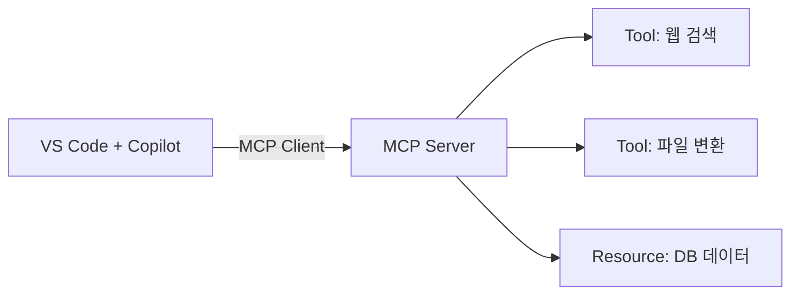

# 제2강. MCP 이해와 기존 서버 연결

## 학습목표

- MCP(Model Context Protocol)의 개념과 아키텍처를 이해한다
- VS Code에서 `.vscode/mcp.json`을 작성해 MCP 서버를 연결한다
- Agent Mode에서 MCP 도구를 호출하여 외부 기능을 활용한다

---

## 2.1 MCP란 무엇인가

GitHub Copilot의 Agent Mode는 코드를 자율적으로 작성하고 터미널 명령을 실행하는 강력한 기능을 제공한다. 그러나 Agent Mode만으로는 웹 브라우저를 조작하거나, 외부 API를 호출하거나, 데이터베이스에 접근하는 등의 작업을 수행할 수 없다. 이러한 한계를 해결하기 위해 등장한 것이 모델 컨텍스트 프로토콜(Model Context Protocol, MCP)이다.

MCP는 AI 에이전트와 외부 도구를 연결하는 범용 표준 프로토콜이다. 흔히 "AI 세계의 USB-C"라고 비유되는데, USB-C가 하나의 포트로 충전, 데이터 전송, 영상 출력을 모두 처리하듯이, MCP는 하나의 프로토콜로 AI 에이전트가 다양한 외부 시스템과 상호작용할 수 있게 한다.

### 탄생과 거버넌스

MCP는 2024년 11월 Anthropic이 처음 공개하였다. 이후 빠르게 산업 전반으로 확산되어 OpenAI, Google, Microsoft 등 주요 AI 플랫폼이 채택하였고, 2025년 12월에는 Anthropic, Block, OpenAI가 공동으로 설립한 리눅스 재단 산하 AAIF(Agentic AI Foundation)로 거버넌스가 이관되었다. 이로써 MCP는 특정 기업의 독점 기술이 아닌, 개방형 산업 표준으로 자리매김하였다. 현재 안정 버전은 2025-11-25 스펙이다.

### 클라이언트-서버 아키텍처

MCP는 호스트(Host), 클라이언트(Client), 서버(Server)의 3계층 구조로 동작한다. 호스트는 VS Code나 Claude Desktop처럼 사용자가 직접 상호작용하는 애플리케이션이다. 호스트 내부의 MCP 클라이언트가 MCP 서버와 통신하며, 서버는 실제 외부 기능(도구, 데이터, 템플릿)을 제공한다.



**그림 2.1** MCP의 클라이언트-서버 아키텍처 개요

### 세 가지 핵심 기능

MCP 서버는 세 가지 유형의 기능을 AI 에이전트에 노출할 수 있다.

**표 2.1** MCP 서버가 제공하는 세 가지 기능(Capability)

| 기능 | 설명 | 예시 |
|------|------|------|
| Tools (도구) | AI가 호출할 수 있는 동작(action) | 웹 페이지 탐색, 이슈 생성, 파일 변환 |
| Resources (리소스) | AI가 읽을 수 있는 데이터 소스 | 데이터베이스 테이블, 파일 내용, API 응답 |
| Prompts (프롬프트) | 재사용 가능한 프롬프트 템플릿 | 코드 리뷰 체크리스트, 보고서 양식 |

도구(Tools)는 가장 널리 사용되는 기능이다. AI 에이전트가 "무엇을 할 수 있는가"를 정의하며, 사용자의 승인을 받아 실행된다. 리소스(Resources)는 AI가 참고할 수 있는 읽기 전용 데이터를 제공한다. 프롬프트(Prompts)는 특정 작업에 최적화된 프롬프트 템플릿을 서버 측에서 제공하는 기능이다.

### 전송 방식

MCP 서버와 클라이언트 간의 통신은 두 가지 전송(transport) 방식을 지원한다. 로컬 실행에 적합한 표준 입출력(stdio) 방식은 서버 프로세스를 직접 실행하여 표준 입력과 출력으로 메시지를 교환한다. 원격 서버에 적합한 HTTP/SSE(Server-Sent Events) 방식은 네트워크를 통해 통신하며, OAuth 2.1 인증을 지원한다. 이번 강의에서는 로컬 stdio 방식을 중심으로 실습한다.

### 생태계 현황

MCP 생태계는 폭발적으로 성장하고 있다. 2026년 현재 17,000개 이상의 커뮤니티 서버가 공개되어 있으며, MCP SDK는 월간 9,700만 회 이상 다운로드되고 있다. VS Code, Cursor, Claude Desktop, Windsurf 등 주요 AI 코딩 도구가 모두 MCP를 지원하므로, 하나의 MCP 서버를 만들면 어떤 도구에서든 사용할 수 있다는 점이 핵심적인 가치이다.

---

## 2.2 `.vscode/mcp.json` 설정법

VS Code에서 MCP 서버를 사용하려면 프로젝트 루트에 `.vscode/mcp.json` 파일을 작성한다. 이 파일은 어떤 MCP 서버를 어떻게 실행할지를 정의하는 설정 파일이다.

### 파일 생성

프로젝트 루트에 `.vscode` 디렉터리가 없다면 먼저 생성한다. 그 안에 `mcp.json` 파일을 만들면 VS Code가 자동으로 인식한다. VS Code의 Command Palette에서 `MCP: Add Server`를 선택하면 대화형으로 설정을 추가할 수도 있다.

### JSON 구조

`mcp.json`은 크게 두 부분으로 구성된다. `inputs` 배열은 API 키와 같은 비밀 정보를 안전하게 입력받기 위한 변수를 정의한다. `servers` 객체는 실행할 MCP 서버의 이름, 명령어, 인자, 환경 변수를 지정한다. 다음은 Playwright, GitHub, Memory 세 가지 서버를 등록하는 전체 예시이다.

```json
{
  "inputs": [
    {
      "type": "promptString",
      "id": "github-token",
      "description": "GitHub Personal Access Token",
      "password": true
    }
  ],
  "servers": {
    "playwright": {
      "command": "npx",
      "args": ["-y", "@playwright/mcp@latest"]
    },
    "github": {
      "command": "npx",
      "args": ["-y", "@modelcontextprotocol/server-github"],
      "env": {
        "GITHUB_TOKEN": "${input:github-token}"
      }
    },
    "memory": {
      "command": "npx",
      "args": ["-y", "@modelcontextprotocol/server-memory"]
    }
  }
}
```

**그림 2.2** `.vscode/mcp.json`의 전체 구조 예시

### 비밀 정보 처리

`inputs` 배열에서 정의한 변수는 `${input:변수id}` 형식으로 서버 설정에서 참조한다. 위 예시에서 `"GITHUB_TOKEN": "${input:github-token}"`은 서버 실행 시 사용자에게 GitHub PAT(Personal Access Token)를 입력받아 환경 변수로 전달한다. `"password": true`를 지정하면 입력 시 마스킹 처리가 된다. API 키를 코드에 직접 작성하는 것은 보안상 위험하므로 반드시 이 방식을 사용하여야 한다.

### Agent Mode 활성화

MCP 서버를 사용하려면 Copilot Chat이 Agent Mode로 동작하여야 한다. VS Code 설정에서 다음 항목을 확인한다.

```json
"chat.agent.enabled": true
```

이 설정이 활성화되어 있으면 Copilot Chat 패널 상단의 모드 선택기에서 "Agent"를 선택할 수 있다. Agent Mode에서 채팅을 시작하면 등록된 MCP 서버의 도구 목록이 자동으로 로드된다.

### 서버 상태 확인

`.vscode/mcp.json`을 저장하면 VS Code 하단 상태 바에 MCP 서버 아이콘이 나타난다. 이 아이콘을 클릭하면 각 서버의 실행 상태를 확인하고, 개별 서버를 시작하거나 중지할 수 있다. 서버가 정상적으로 실행되면 녹색 표시가 나타나며, 실패 시에는 출력 패널에서 오류 로그를 확인할 수 있다.

---

## 2.3 실습 1: Playwright MCP로 웹 자동화

이번 실습에서는 Playwright MCP 서버를 연결하여 Copilot이 웹 브라우저를 직접 조작하도록 한다.

### 서버 등록

앞서 작성한 `mcp.json`의 `servers` 객체에 Playwright 서버가 이미 포함되어 있다. `npx -y @playwright/mcp@latest` 명령은 Playwright MCP 서버를 자동으로 다운로드하고 실행한다. 별도의 설치 과정 없이 `npx`가 패키지를 임시로 가져와 실행하므로 Node.js 18 이상이 설치되어 있으면 곧바로 사용할 수 있다.

### 웹 페이지 탐색

Agent Mode에서 다음과 같이 요청한다.

> "https://news.ycombinator.com 에 접속해서 현재 상위 5개 뉴스 제목을 가져와 줘"

Copilot은 Playwright MCP 서버가 제공하는 도구들을 순차적으로 호출한다. 먼저 `browser_navigate` 도구로 해당 URL에 접속하고, `browser_snapshot` 도구로 페이지의 접근성 트리(accessibility tree)를 읽어 들인다. 이 과정에서 Copilot은 사용자에게 도구 실행 승인을 요청하며, "Continue" 또는 세션 내 자동 승인을 선택할 수 있다.

Copilot이 페이지 내용을 분석하면 상위 5개 뉴스 제목을 추출하여 보여준다. 이어서 다음과 같이 후속 작업을 요청할 수 있다.

> "이 결과를 news_report.md 파일로 정리해 줘"

Copilot은 추출한 데이터를 마크다운 형식으로 구성하여 파일을 생성한다. 이 과정에서 MCP 도구(웹 탐색)와 기본 기능(파일 생성)이 자연스럽게 결합되는 것을 확인할 수 있다.

### 호출된 도구 분석

**표 2.2** Playwright MCP 서버의 주요 도구

| 도구 이름 | 기능 | 호출 시점 |
|----------|------|----------|
| `browser_navigate` | 지정한 URL로 이동 | 웹 페이지 접속 시 |
| `browser_snapshot` | 현재 페이지의 접근성 트리 반환 | 페이지 내용 파악 시 |
| `browser_click` | 특정 요소 클릭 | 링크·버튼 상호작용 시 |
| `browser_type` | 텍스트 입력 | 검색어·폼 입력 시 |

Playwright MCP는 스크린샷 방식이 아닌 접근성 트리 기반으로 페이지를 분석한다. 이 방식은 이미지 처리 비용 없이 빠르게 페이지 구조를 파악할 수 있다는 장점이 있다.

---

## 2.4 실습 2: GitHub MCP로 이슈 관리

두 번째 실습에서는 GitHub MCP 서버를 연결하여 Copilot이 저장소의 이슈와 커밋을 관리하도록 한다.

### 사전 준비: Personal Access Token 발급

GitHub MCP 서버는 GitHub API에 접근하기 위해 PAT(Personal Access Token)가 필요하다. GitHub 설정 페이지(Settings > Developer settings > Personal access tokens > Fine-grained tokens)에서 토큰을 발급받는다. 필요한 권한은 저장소의 이슈(Issues) 읽기/쓰기와 메타데이터(Metadata) 읽기이다. 발급받은 토큰은 `mcp.json`의 `${input:github-token}` 변수를 통해 안전하게 전달된다.

### 이슈 조회

Agent Mode에서 다음과 같이 요청한다.

> "이 저장소의 열린 이슈 목록을 보여줘"

Copilot은 GitHub MCP 서버의 `list_issues` 도구를 호출하여 현재 열려 있는 이슈 목록을 가져온다. 각 이슈의 번호, 제목, 라벨, 담당자 정보가 표 형태로 정리되어 출력된다.

### 이슈 생성

이어서 새로운 이슈를 생성한다.

> "새 이슈를 만들어 줘: '로그인 페이지 UI 개선' 제목으로, 라벨은 enhancement"

Copilot은 `create_issue` 도구를 호출하여 지정한 제목과 라벨로 이슈를 생성한다. 이 과정에서 도구 호출 전 사용자 승인을 요청하므로, 의도하지 않은 이슈 생성을 방지할 수 있다.

### 커밋 요약

마지막으로 최근 커밋 내역을 요약한다.

> "최근 커밋 5개를 요약해 줘"

Copilot은 `list_commits` 도구로 최근 5개 커밋을 조회하고, 각 커밋의 메시지와 변경 내용을 요약하여 보여준다. 이처럼 GitHub MCP 서버를 연결하면 Copilot이 코드 작성뿐 아니라 프로젝트 관리 작업까지 수행할 수 있게 된다.

---

## 2.5 실습 3: Memory MCP로 대화 기억

세 번째 실습에서는 Memory MCP 서버를 연결하여 Copilot이 대화 세션 간에 정보를 기억하도록 한다. 일반적으로 Copilot Chat은 새 세션을 시작하면 이전 대화 내용을 기억하지 못한다. Memory MCP 서버는 지식 그래프(Knowledge Graph) 형태로 정보를 저장하여 이 한계를 극복한다.

### 정보 저장

Agent Mode에서 다음과 같이 프로젝트 정보를 알려준다.

> "이 프로젝트는 Flask 기반이고, DB는 PostgreSQL이야. 배포는 Docker로 한다. 기억해 둬."

Copilot은 Memory MCP 서버의 `create_entities` 도구를 호출하여 "프로젝트", "Flask", "PostgreSQL", "Docker" 등의 개체(entity)를 생성하고, `create_relations` 도구로 이들 간의 관계를 설정한다. 이 정보는 로컬 파일 시스템에 JSON 형태로 영속 저장된다.

### 정보 조회

새로운 채팅 세션을 열고 다음과 같이 질문한다.

> "이 프로젝트의 기술 스택이 뭐였지?"

Copilot은 Memory MCP 서버의 `read_graph` 도구를 호출하여 이전에 저장한 지식 그래프에서 관련 정보를 검색한다. 세션이 바뀌었음에도 불구하고 "Flask 기반, PostgreSQL 사용, Docker 배포"라는 정보가 정확하게 반환된다.

이러한 영속 메모리(persistent memory)는 장기 프로젝트에서 특히 유용하다. 코딩 컨벤션, 아키텍처 결정 사항, 팀 규칙 등을 한번 저장해 두면 매번 반복 설명할 필요가 없어진다.

---

## 2.6 MCP 서버 탐색: Registry와 갤러리

세 가지 MCP 서버를 직접 연결해 보았다. 그러나 실제로 사용할 수 있는 MCP 서버는 이보다 훨씬 다양하다. 필요한 서버를 찾는 방법을 알아본다.

### VS Code 내 탐색

VS Code의 확장 프로그램 뷰에서 `@mcp`를 검색하면 사용 가능한 MCP 서버 목록을 탐색할 수 있다. AutomataLabs가 제공하는 Copilot MCP 확장을 설치하면 GUI 기반으로 서버를 검색하고 `mcp.json`에 추가하는 과정을 간소화할 수 있다.

### GitHub MCP Registry

공식 MCP Registry(modelcontextprotocol/registry)는 커뮤니티에서 공개한 MCP 서버를 검색하고 색인하는 저장소이다. 각 서버의 기능 설명, 설치 방법, 설정 예시가 포함되어 있어 빠르게 필요한 서버를 찾을 수 있다.

### 자주 사용되는 서버

**표 2.3** 실무에서 자주 사용되는 MCP 서버

| 서버 | 패키지 | 용도 |
|------|--------|------|
| Playwright | `@playwright/mcp` | 웹 브라우저 자동화 |
| GitHub | `@modelcontextprotocol/server-github` | 저장소·이슈·PR 관리 |
| Memory | `@modelcontextprotocol/server-memory` | 대화 간 정보 기억 |
| Filesystem | `@modelcontextprotocol/server-filesystem` | 파일 시스템 접근 |
| Notion | `@notionhq/notion-mcp-server` | Notion 문서 관리 |
| Figma | `@anthropic/figma-mcp` | Figma 디자인 데이터 접근 |
| Sentry | `@sentry/mcp-server-sentry` | 에러 모니터링 조회 |

이 표에 나열된 서버 외에도 데이터베이스 접속, 클라우드 인프라 관리, 메신저 연동 등 다양한 분야의 서버가 지속적으로 추가되고 있다. 하나의 MCP 서버를 만들거나 연결해 두면 Copilot, Claude Code, Cursor 어디서든 동일하게 사용할 수 있다는 것이 MCP 표준의 가장 큰 장점이다.

---

## 핵심정리

- MCP(Model Context Protocol)는 AI 에이전트와 외부 도구를 연결하는 범용 표준이다
- `.vscode/mcp.json`에 서버를 등록하면 Agent Mode에서 자동으로 도구가 사용 가능해진다
- 비밀 정보(API 키, 토큰)는 `${input:id}` 변수로 안전하게 처리한다
- MCP 서버는 Tools(동작), Resources(데이터), Prompts(템플릿) 세 가지 기능을 제공한다
- 하나의 MCP 서버를 만들면 Copilot, Claude Code, Cursor 등 어떤 도구에서든 사용할 수 있다

---

## 참고문헌

Anthropic. (2024). Introducing the Model Context Protocol. *Anthropic Blog*. https://www.anthropic.com/news/model-context-protocol

Model Context Protocol. (2025). MCP Specification (2025-11-25). *GitHub*. https://github.com/modelcontextprotocol/specification

Linux Foundation. (2025). Announcing the Agentic AI Foundation. *Linux Foundation Blog*. https://www.linuxfoundation.org/press/announcing-agentic-ai-foundation

---

## 다음 강의 예고

이번 강의에서는 이미 만들어진 MCP 서버를 연결하여 Copilot의 기능을 확장하는 방법을 배웠다. 제3강에서는 한 단계 더 나아가, Python으로 나만의 MCP 서버를 직접 만들어 본다. 외부 API를 MCP 서버로 래핑하는 과정을 통해 "도구를 사용하는 사람"에서 "도구를 만드는 사람"으로 전환하는 경험을 하게 된다.
