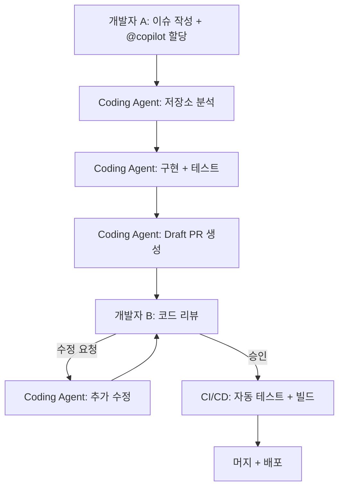
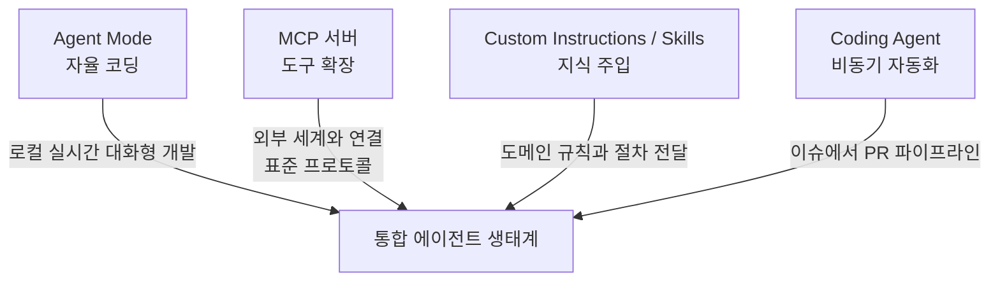

# 제6강. Coding Agent와 팀 워크플로우

## 학습목표

- GitHub Copilot Coding Agent의 작동 방식을 이해한다
- 이슈 할당에서 PR 생성까지의 자동화 파이프라인을 구축한다
- 에이전트가 만든 코드의 리뷰와 품질 관리 방법을 익힌다

## 선수지식

제1강에서 다룬 에이전트 모드(Agent Mode)의 자율 실행 루프를 이해하고 있어야 한다. GitHub 계정과 저장소 관리 권한이 필요하며, GitHub Actions의 기본 개념(워크플로우, 러너, 작업)을 알고 있으면 실습을 따라가기에 수월하다.

---

## 6.1 Coding Agent란 무엇인가

제1강에서 배운 에이전트 모드(Agent Mode)는 개발자가 VS Code 안에서 실시간으로 대화하며 코드를 작성하는 방식이었다. 이 방식은 복잡한 설계 탐색이나 즉각적인 피드백이 필요한 작업에 효과적이지만, 개발자가 IDE 앞에 앉아 있어야 한다는 제약이 있다. 코딩 에이전트(Coding Agent)는 이 제약을 제거한다.

코딩 에이전트는 2025년 9월 정식 출시(GA)된 클라우드 기반 자율 에이전트이다. 개발자가 GitHub 이슈에 `@copilot`을 담당자(assignee)로 할당하면, 에이전트가 클라우드 환경에서 독립적으로 작업을 시작한다. 개발자는 이슈를 할당한 뒤 다른 업무를 수행하면 되고, 에이전트가 작업을 완료하면 드래프트 풀 리퀘스트(Draft Pull Request)가 생성되어 알림을 받는다.

코딩 에이전트의 작업 흐름은 다섯 단계로 구성된다. 첫째, 개발자가 GitHub 이슈를 작성하고 `@copilot`을 담당자로 할당한다. Copilot Chat에서 이슈를 위임하는 것도 가능하다. 둘째, 에이전트가 GitHub Actions 기반의 안전하고 격리된 개발 환경(secure, isolated development environment)을 구동한다. 셋째, 저장소의 코드를 분석하고 새 브랜치를 생성한 뒤 변경 사항을 구현한다. 넷째, 커밋을 푸시하고 드래프트 PR을 연다. 다섯째, 이슈 할당자가 공동 작성자(co-author)로 기재되지만, 해당 PR을 직접 승인할 수는 없다. 독립적인 리뷰어가 반드시 필요하다.

이 마지막 규칙은 코딩 에이전트 설계에서 가장 중요한 안전장치이다. 이슈를 만든 사람이 곧바로 PR을 승인할 수 있다면, 에이전트의 결과물이 충분한 검증 없이 머지될 위험이 있다. 할당자와 승인자를 분리함으로써 최소 한 명의 독립적인 사람이 코드를 검토하도록 보장하는 것이다.

에이전트 모드와 코딩 에이전트는 배타적 관계가 아니라 상호 보완적이다. 다음 표는 두 방식의 핵심 차이를 정리한 것이다.

**표 6.1** Agent Mode와 Coding Agent 비교

| 구분 | Agent Mode (IDE) | Coding Agent (Cloud) |
|------|-----------------|---------------------|
| 실행 환경 | 로컬 (VS Code) | 클라우드 (GitHub Actions) |
| 작업 방식 | 실시간 대화형 | 비동기 (이슈 할당 후 자동 처리) |
| 승인 | 터미널 명령마다 사용자 승인 | MCP 도구 자율 사용 |
| 산출물 | 로컬 파일 수정 | 브랜치 + 커밋 + Draft PR |
| 적합한 작업 | 복잡한 설계, 탐색적 개발 | 명확한 구현 작업, 반복적 수정 |

복잡한 아키텍처를 탐색하거나 여러 선택지를 비교해야 하는 작업에는 에이전트 모드가 적합하다. 반면 "이 함수를 추가한다", "이 버그를 수정한다"처럼 완료 조건이 명확한 작업에는 코딩 에이전트가 효율적이다. 숙련된 개발자는 하루 동안 에이전트 모드로 설계를 진행하면서, 구현 세부 사항은 이슈로 작성하여 코딩 에이전트에 위임하는 식으로 두 방식을 병행한다.

---

## 6.2 Coding Agent 설정

코딩 에이전트를 사용하려면 저장소 수준에서 몇 가지 설정을 완료해야 한다.

첫째, 저장소 설정에서 코딩 에이전트를 활성화한다. GitHub 웹에서 저장소의 Settings 탭으로 이동한 뒤, 좌측 메뉴에서 Copilot > Coding agent를 선택하여 Enable로 전환한다. 이 설정은 저장소 관리자(admin) 권한이 필요하다.

둘째, 허용할 MCP 서버를 설정한다. 코딩 에이전트가 외부 도구에 접근해야 하는 경우, 저장소 설정에서 허용된 MCP 서버 목록을 지정할 수 있다. 이 설정은 선택 사항이지만, 6.5절에서 다룰 Sentry 연동 같은 고급 시나리오에서 필요하다.

셋째, 환경 설정 파일을 작성한다. 코딩 에이전트가 클라우드에서 코드를 실행하려면 의존성 설치나 빌드 도구 설정이 필요할 수 있다. 이를 위해 저장소 루트에 `copilot-setup-steps.yml` 파일을 추가한다.

```yaml
steps:
  - uses: actions/setup-python@v5
    with:
      python-version: '3.12'
  - run: pip install -r requirements.txt
```

이 파일은 GitHub Actions의 워크플로우 스텝 형식을 따른다. 에이전트가 작업을 시작하기 전에 이 스텝들이 먼저 실행되어 개발 환경이 준비된다. Node.js 프로젝트라면 `actions/setup-node`와 `npm install`을, Java 프로젝트라면 `actions/setup-java`와 `mvn install`을 사용하면 된다.

넷째, 브랜치 보호 규칙(Branch Protection Rules)을 설정한다. 코딩 에이전트가 생성하는 브랜치는 `copilot/fix-*`와 같은 패턴을 따른다. 메인 브랜치에 직접 푸시되는 것을 방지하기 위해, PR 리뷰 필수와 상태 검사 통과를 요구하는 브랜치 보호 규칙을 반드시 설정해야 한다. 이 규칙이 없으면 에이전트의 결과물이 검증 없이 머지될 수 있으므로, 실무 환경에서는 반드시 적용한다.

---

## 6.3 실습 1: 이슈에서 PR까지

이 절에서는 코딩 에이전트의 전체 워크플로우를 처음부터 끝까지 체험한다. 비밀번호 강도 검증 함수를 추가하는 작업을 이슈로 작성하고, 코딩 에이전트가 구현부터 테스트까지 자율적으로 수행하는 과정을 관찰한다.

먼저 GitHub 웹에서 이슈를 생성한다. 제목은 "로그인 API에 비밀번호 강도 검증 함수 추가"로 작성하고, 본문에는 다음과 같이 명확한 요구사항을 기술한다.

```
## 요구사항
`auth/validators.py`에 `validate_password_strength(password: str) -> dict` 함수를 추가한다.

## 검증 조건
- 최소 8자 이상
- 대문자 1개 이상 포함
- 소문자 1개 이상 포함
- 숫자 1개 이상 포함
- 특수문자(!@#$%^&*) 1개 이상 포함

## 반환값
각 조건의 충족 여부를 불리언으로, 전체 통과 여부를 `is_valid` 키로 포함하는 딕셔너리를 반환한다.

## 테스트
pytest로 각 조건별 통과/실패 케이스를 검증하는 테스트를 작성한다.
```

이슈를 생성한 뒤, Assignees 항목에서 `copilot`을 검색하여 담당자로 할당한다. 할당이 완료되면 코딩 에이전트가 자동으로 작업을 시작한다.

에이전트는 먼저 저장소 구조를 분석한다. 기존 코드의 스타일, 테스트 프레임워크, 디렉터리 구조를 파악한 뒤, 새 브랜치를 생성하고 구현을 시작한다. 구현이 완료되면 테스트를 작성하고 실행하여 모든 테스트가 통과하는지 확인한다. 최종적으로 커밋을 푸시하고 드래프트 PR을 열며, 이슈와 PR이 자동으로 연결된다.

에이전트가 생성하는 검증 함수의 핵심 로직은 대체로 다음과 같은 구조를 따른다.

```python
import re

def validate_password_strength(password: str) -> dict:
    results = {
        "min_length": len(password) >= 8,
        "has_upper": bool(re.search(r"[A-Z]", password)),
        "has_special": bool(re.search(r"[!@#$%^&*]", password)),
    }
    results["is_valid"] = all(results.values())
    return results
```

PR이 생성되면 리뷰를 수행한다. 코드 품질, 테스트 커버리지, 엣지 케이스 처리를 점검하고, 부족한 부분이 있으면 PR 코멘트로 수정을 요청한다. 코딩 에이전트는 리뷰 코멘트를 읽고 추가 수정을 시도하므로, 구체적이고 명확한 피드백을 작성하는 것이 중요하다. 모든 검토가 완료되면 독립적인 리뷰어가 승인하고 머지한다.

---

## 6.4 좋은 이슈 작성법

코딩 에이전트의 출력 품질은 이슈의 품질에 직접적으로 비례한다. 모호한 이슈는 모호한 코드를 만들고, 명확한 이슈는 명확한 코드를 만든다. 이 절에서는 좋은 이슈와 나쁜 이슈의 차이를 구체적으로 살펴본다.

좋은 이슈에는 다섯 가지 요소가 포함된다. 첫째, 제목은 기대하는 결과를 한 문장으로 표현한다. "비밀번호 관련 작업"이 아니라 "로그인 API에 비밀번호 강도 검증 함수 추가"처럼 구체적으로 작성한다. 둘째, 본문에는 수락 기준(Acceptance Criteria)을 명시한다. 에이전트가 "완료"를 판단할 수 있는 객관적인 조건이 필요하다. 셋째, 수정할 파일이나 디렉터리를 힌트로 제공한다. 에이전트가 저장소 전체를 탐색하는 시간을 줄일 수 있으며, 잘못된 위치에 코드를 생성하는 것을 방지한다. 넷째, 테스트 기준을 기술한다. 어떤 입력에 대해 어떤 출력이 나와야 하는지, 어떤 경계 조건을 확인해야 하는지를 명시하면 에이전트가 자체적으로 검증까지 수행한다. 다섯째, 제약 조건을 밝힌다. 사용할 라이브러리, 따라야 할 코딩 패턴, 성능 요구사항 등을 명시하여 에이전트의 선택 범위를 한정한다.

다음은 동일한 작업에 대한 나쁜 이슈와 좋은 이슈의 비교이다.

**표 6.2** 이슈 품질 비교

| 구분 | 나쁜 이슈 | 좋은 이슈 |
|------|----------|----------|
| 제목 | "비밀번호 기능 추가" | "로그인 API에 비밀번호 강도 검증 함수 추가" |
| 본문 | "비밀번호 체크하는 거 만들어 주세요" | 검증 조건, 반환값 형식, 대상 파일 경로를 상세 기술 |
| 테스트 | 언급 없음 | "pytest로 조건별 통과/실패 테스트 작성" |
| 제약 | 언급 없음 | "정규식 사용, 외부 라이브러리 불필요" |

나쁜 이슈를 받은 에이전트는 "비밀번호 기능"이 무엇인지부터 추측해야 한다. 암호화인지, 검증인지, 재설정인지 알 수 없으므로 예상과 다른 코드를 생성할 확률이 높다. 반면 좋은 이슈는 에이전트가 해석해야 할 모호함을 최소화하여, 첫 번째 시도에서 원하는 결과에 근접할 수 있게 한다.

현재 코딩 에이전트는 이슈 작성자에게 역으로 질문하는 기능(interactive clarification)을 지원하지 않는다. 에이전트 모드에서는 VS Code 안에서 실시간으로 "이 부분은 어떻게 할까요?"라고 물어볼 수 있지만, 코딩 에이전트는 주어진 이슈만으로 작업을 완료해야 한다. 따라서 이슈의 완결성이 결과 품질에 결정적인 영향을 미친다.

---

## 6.5 실습 2: MCP 서버를 활용하는 Coding Agent

코딩 에이전트는 기본적으로 저장소 내부의 코드만 분석하고 수정할 수 있다. 그러나 MCP 서버를 연결하면 외부 시스템의 데이터를 에이전트에게 제공할 수 있다. 이 절에서는 Sentry MCP 서버를 연결하여, 에이전트가 실제 에러 데이터를 기반으로 수정 코드를 작성하는 시나리오를 실습한다.

MCP 서버 설정은 저장소의 `.github/copilot/mcp.json` 파일에 정의한다. 다음은 Sentry MCP 서버를 연결하는 설정 예시이다.

```json
{
  "mcpServers": {
    "sentry": {
      "type": "http",
      "url": "https://mcp.sentry.dev/sse",
      "headers": {
        "Authorization": "Bearer $COPILOT_MCP_SENTRY_TOKEN"
      },
      "tools": ["search_errors", "get_error_details"]
    }
  }
}
```

`$COPILOT_MCP_SENTRY_TOKEN`은 저장소의 Secrets에 등록한 환경 변수이다. `tools` 배열은 에이전트가 사용할 수 있는 도구를 제한하는 역할을 한다. 이 필드를 생략하면 서버가 제공하는 모든 도구가 활성화되는데, 최소 권한 원칙(Principle of Least Privilege)에 따라 필요한 도구만 명시적으로 허용하는 것이 바람직하다.

설정이 완료되면 다음과 같은 이슈를 작성한다.

```
## 요구사항
Sentry에서 가장 빈번하게 발생하는 에러 3개를 조사하고,
각각에 대한 수정 코드를 작성한다.

## 절차
1. Sentry MCP의 search_errors 도구로 빈도순 에러 목록을 조회한다
2. 상위 3개 에러의 상세 정보를 get_error_details로 확인한다
3. 각 에러의 원인을 분석하고 수정 코드를 구현한다
4. 수정한 코드에 대한 테스트를 작성한다
```

이 이슈를 `@copilot`에 할당하면, 에이전트는 Sentry MCP 서버를 통해 실제 프로덕션 에러 데이터를 조회한다. 가상의 에러가 아닌 실제로 발생하고 있는 문제를 기반으로 수정 코드를 작성하므로, 결과물의 실용성이 높아진다.

이 워크플로우는 코딩 에이전트의 가장 강력한 활용 패턴 중 하나이다. 개발자가 매일 아침 Sentry 대시보드를 확인하는 대신, 에러 수정 이슈를 코딩 에이전트에 위임하고 출근 후 PR을 리뷰하는 것만으로 에러 대응 속도를 크게 높일 수 있다.

---

## 6.6 팀 워크플로우 설계

코딩 에이전트를 개인이 사용하는 것과 팀 전체의 워크플로우에 통합하는 것은 다른 차원의 문제이다. 이 절에서는 코딩 에이전트를 팀 개발 프로세스에 안전하게 통합하는 방법을 설계한다.

팀 워크플로우의 전체 흐름은 다음과 같다.



**그림 6.1** 코딩 에이전트를 포함한 팀 개발 워크플로우

이 워크플로우에서 핵심적인 규칙이 네 가지 있다. 첫째, 이슈 할당자는 공동 작성자(co-author)로 등록되므로 해당 PR을 승인할 수 없다. 이 규칙은 독립적인 코드 리뷰를 보장하는 가장 근본적인 안전장치이다. 둘째, 브랜치 보호 규칙이 반드시 설정되어 있어야 한다. 에이전트가 메인 브랜치에 직접 커밋하는 것을 원천 차단해야 한다. 셋째, CI 파이프라인의 모든 테스트가 통과해야 머지할 수 있다. 에이전트가 작성한 테스트뿐 아니라 기존 테스트 스위트도 모두 통과해야 한다. 넷째, 에이전트는 스스로 머지하지 않는다. 최종 머지 결정은 반드시 사람이 내린다.

이러한 규칙들이 적용된 팀 워크플로우에서는 코딩 에이전트가 "주니어 개발자"와 유사한 역할을 수행한다. 명확한 작업 지시(이슈)를 받아 구현하고, 시니어 개발자(리뷰어)의 검토와 승인을 거쳐 코드가 반영된다. 차이점은 에이전트가 비동기적으로 동작하므로 리뷰어의 업무 시간과 독립적으로 작업을 진행할 수 있다는 것이다.

팀 규모와 프로젝트 성격에 따라 코딩 에이전트의 활용 범위를 단계적으로 확대하는 것이 현실적이다. 초기에는 문서 수정, 테스트 추가, 린트 오류 수정 같은 저위험 작업부터 시작하여, 팀이 리뷰 프로세스에 익숙해지면 기능 구현 수준까지 확대하는 접근이 안전하다.

---

## 6.7 한계와 주의사항

코딩 에이전트는 강력한 도구이지만, 현재 시점에서 분명한 한계가 있다. 이 한계를 정직하게 인식하는 것이 도구를 현명하게 사용하기 위한 전제 조건이다.

첫째, 코딩 에이전트는 낮은 복잡도에서 중간 복잡도의 작업에 가장 적합하다. 함수 하나를 추가하거나, 기존 API의 엔드포인트를 수정하거나, 단위 테스트를 보강하는 등의 작업에서 높은 성공률을 보인다. 반면 여러 서비스에 걸친 아키텍처 변경이나 복잡한 비즈니스 로직의 재설계는 현재 능력 범위를 벗어난다.

둘째, 깊은 도메인 지식이 필요한 작업에서 어려움을 겪는다. 금융 규정에 따른 계산 로직, 의료 데이터 처리 규칙, 특정 산업의 프로토콜 구현 등은 일반적인 학습 데이터에 충분히 포함되어 있지 않으므로, 에이전트가 올바른 구현을 보장하기 어렵다.

셋째, 이슈 설명의 품질에 결과가 크게 좌우된다. 6.4절에서 다룬 것처럼, 모호한 이슈는 예상과 다른 결과를 만든다. 특히 현재 코딩 에이전트는 역으로 질문을 하는 기능이 없으므로, 이슈가 불명확하면 에이전트가 임의로 해석하여 작업을 진행한다.

넷째, 보안에 민감한 변경이나 프로덕션 핵심 로직의 수정에는 각별한 주의가 필요하다. 에이전트가 생성한 코드가 기능적으로 동작하더라도, 보안 취약점이나 성능 저하를 유발할 수 있다. 이러한 영역에서는 에이전트의 결과물을 제안(suggestion)으로만 취급하고, 반드시 전문 리뷰어의 면밀한 검토를 거쳐야 한다.

다섯째, 코딩 에이전트는 GitHub Actions 분(minutes)을 소비한다. 무료 플랜에서는 월간 Actions 사용량이 제한되어 있으므로, 빈번한 사용 시 비용이 발생할 수 있다. 이슈 하나에 대해 에이전트가 구동되는 시간은 작업의 복잡도에 따라 수 분에서 수십 분까지 다양하다.

이러한 한계는 코딩 에이전트 자체의 문제라기보다, 현재 LLM 기반 코드 생성의 일반적인 한계에 해당한다. 기술이 발전함에 따라 처리 가능한 복잡도의 범위는 점차 넓어질 것이지만, "사람의 검토가 필요하다"는 근본적인 원칙은 상당 기간 유효할 것이다.

---

## 6.8 전체 강의 회고: Copilot 에이전트 생태계

이번 강의는 6강 시리즈의 마지막이다. 전체 과정을 통해 다루어 온 네 가지 핵심 요소가 어떻게 하나의 생태계를 구성하는지 되돌아본다.



**그림 6.2** Copilot 에이전트 생태계의 네 가지 축

제1강에서 다룬 에이전트 모드(Agent Mode)는 이 생태계의 출발점이다. 개발자가 VS Code 안에서 자연어로 목표를 기술하면, Copilot이 자율적으로 코드를 작성하고 실행하며 오류를 수정하는 루프를 경험하였다. 이 자율 실행 루프의 원리를 이해하는 것이 이후 모든 학습의 기반이 되었다.

제2강과 제3강에서 다룬 MCP(Model Context Protocol)는 에이전트의 능력을 외부로 확장하는 표준 프로토콜이다. 기존 MCP 서버를 연결하는 방법부터 나만의 MCP 서버를 직접 만드는 과정까지를 거치면서, 에이전트가 웹 브라우저, 데이터베이스, 외부 API 등과 상호작용할 수 있게 되었다.

제4강과 제5강에서 다룬 커스텀 인스트럭션(Custom Instructions)과 스킬(Skills)은 에이전트에게 도메인 지식을 주입하는 메커니즘이다. `.github/copilot-instructions.md`를 통해 프로젝트의 코딩 규칙을 전달하고, 재사용 가능한 프롬프트 파일로 반복적인 작업 절차를 표준화하였다.

그리고 이번 제6강에서 다룬 코딩 에이전트(Coding Agent)는 이 모든 요소를 비동기 자동화 파이프라인으로 통합하는 마지막 조각이다. 이슈에서 PR까지의 전체 흐름을 자동화하면서도, 독립적인 코드 리뷰를 통해 품질을 보장하는 구조를 설계하였다.

이 네 가지 요소를 넘어, 에이전트 기술의 흐름은 계속 확장되고 있다. A2A(Agent-to-Agent) 프로토콜은 에이전트 간 통신의 표준을 정립하고 있으며, 에이전트 메모리(Agent Memory) 기술은 과거 상호작용에서 학습하는 에이전트를 가능하게 한다. 기업 환경에서는 여러 에이전트가 역할을 분담하여 협업하는 멀티에이전트 팀(Multi-Agent Teams)이 실험되고 있다.

이러한 기술적 진화에도 불구하고, 이 과정에서 일관되게 강조해 온 원칙은 변하지 않는다. 에이전트는 도구이며, 최종 판단은 사람이 내린다. 에이전트가 생성한 코드는 반드시 검증해야 하고, 보안과 품질에 대한 책임은 개발자에게 있다. 이 원칙 위에서 도구를 전략적으로 활용하는 것이 AI 시대 개발자의 핵심 역량이다.

---

## 핵심정리

- Coding Agent는 GitHub 이슈에서 Draft PR까지를 비동기적으로 자동화하는 클라우드 기반 에이전트이다
- 좋은 이슈가 좋은 PR을 만든다 (이슈의 품질이 결과의 품질을 결정한다)
- 이슈 할당자는 공동 작성자로 등록되어 해당 PR을 직접 승인할 수 없다 (독립적 리뷰 보장)
- Agent Mode(실시간 대화형)와 Coding Agent(비동기 자동화)를 작업 성격에 맞게 병행하여 사용한다
- 에이전트 생태계의 네 가지 축은 Agent Mode, MCP, Skills, Coding Agent이며, 모두 오픈 표준 위에 구축되어 있다

---

## 과정 마무리

이 과정에서 다룬 네 가지 요소(Agent Mode, MCP, Custom Instructions/Skills, Coding Agent)는 모두 오픈 표준(MCP)과 범용 도구(VS Code, GitHub) 위에 구축되어 있다. 특정 제품에 종속되지 않는 이 기반 위에서, 각자의 도메인에 맞는 에이전트를 설계하고 발전시켜 나가기를 바란다. 에이전트 기술은 빠르게 진화하고 있지만, "문제를 정의하고, 도구를 선택하고, 결과를 검증하는" 개발자의 역할은 오히려 더 중요해지고 있다. 이 과정이 그 역할을 수행하기 위한 출발점이 되었기를 바란다.

---

## 참고문헌

GitHub. (2025). GitHub Copilot coding agent documentation. *GitHub Docs*. https://docs.github.com/en/copilot/using-github-copilot/using-copilot-coding-agent

GitHub. (2025). Configuring coding agent. *GitHub Docs*. https://docs.github.com/en/copilot/configuring-github-copilot/configuring-coding-agent

GitHub. (2025). About the copilot-setup-steps.yml file. *GitHub Docs*. https://docs.github.com/en/copilot/customizing-copilot/customizing-the-development-environment-for-copilot-coding-agent
